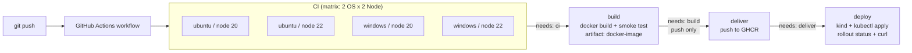

# Session 16 — CI/CD with GitHub Actions

| | |
|---|---|
| **Student** | Rohan Singh |
| **Enrollment No.** | 24BCS10240 |
| **Session** | 16 — CI/CD & GitHub Actions |
| **Branch** | `main` |
| **Workflow file** | [`.github/workflows/24bcs10240-session16-cicd.yml`](../../.github/workflows/24bcs10240-session16-cicd.yml) |

## Task checklist

- [x] CI vs CD: explained, and both run in one pipeline
- [x] Pipeline: lint → test → build → push → deploy, chained with `needs`
- [x] Workflow: triggered by `push`, `pull_request` and `workflow_dispatch`, filtered by branch and path
- [x] Jobs and steps: 4 jobs (`ci`, `build`, `deliver`, `deploy`), each made of named steps
- [x] Runners: build matrix on **ubuntu-latest + windows-latest** × **Node 20 + Node 22** (4 parallel runners)
- [x] Secrets: repo secret `APP_GREETING` → Kubernetes Secret → container env var (never printed). `GITHUB_TOKEN` is used to push to GHCR
- [x] Artifacts: JUnit + coverage report for each matrix leg, and the Docker image tarball
- [x] Build: `docker build` plus a container smoke test
- [x] Test: Jest unit and HTTP tests with a coverage threshold (80% lines)
- [x] CD: image pushed to `ghcr.io/rohansst/s16-cicd-demo-24bcs10240`, then deployed to a kind cluster in the runner with `kubectl apply`, `rollout status` and a curl smoke test
- [x] Execution: green run, red run (bug added on purpose), and green again after the fix. All runs below are real.

---

## 1. Project layout

```text
session-16-github-actions/Rohan-24BCS10240/
├── src/
│   ├── app.js          # Express app factory (/, /health, /api/:op)
│   ├── calculator.js   # add / subtract / multiply / divide
│   └── server.js       # entrypoint (PORT, default 3000)
├── test/app.test.js    # 12 Jest + supertest tests
├── k8s/
│   ├── deployment.yaml # 2 replicas, probes, limits, env from Secret
│   └── service.yaml    # ClusterIP :80 -> 3000
├── Dockerfile          # node:22-alpine, npm ci --omit=dev, USER node
├── eslint.config.js
├── package.json / package-lock.json
└── README.md
.github/workflows/24bcs10240-session16-cicd.yml   # at repo root, where GitHub reads workflows
```

### Run locally

```bash
cd session-16-github-actions/Rohan-24BCS10240
npm ci
npm run lint
npm test                      # jest --ci --coverage -> reports/junit.xml + coverage/
npm start                     # http://localhost:3000

docker build -t s16-cicd-demo .
docker run -p 3000:3000 -e APP_GREETING="hi" s16-cicd-demo
curl "localhost:3000/api/multiply?a=6&b=7"
```

---

## 2. Concepts

### CI vs CD

| | Continuous Integration (CI) | Continuous Delivery / Deployment (CD) |
|---|---|---|
| Goal | Every change is checked automatically | Every change that passes CI can be released |
| In this pipeline | `ci` job: install, lint, unit tests, coverage on 4 runners; `build` job: Docker image + container smoke test | `deliver` job: push image to GHCR (**delivery**); `deploy` job: roll it out to Kubernetes and smoke-test it (**deployment**) |
| Runs on | push, pull_request, manual | only `push` / `workflow_dispatch` (`if:`). Pull requests stop after `build` |

### Pipeline



If any matrix leg fails, `build`, `deliver` and `deploy` are **skipped**. The red run below shows this.

### Workflow, jobs, steps, runners

- **Workflow**: the YAML file at `.github/workflows/24bcs10240-session16-cicd.yml`. GitHub only reads workflows from the repo root, so the file lives there. `defaults.run.working-directory` points every `run:` step at this folder.
- **Triggers**: `push` (only branch `session16`), `pull_request` and `workflow_dispatch`. All of them use a `paths` filter on this folder and the workflow file. `!**/*.md` stops README-only commits from starting the pipeline.
- **Jobs**: `ci`, `build`, `deliver`, `deploy`. Each job gets a fresh VM. Jobs share data only through **artifacts** (the image tarball) or **outputs** (`deliver.outputs.image` gives the image tag to `deploy`).
- **Steps**: either `uses:` (a reusable action such as `actions/checkout@v6`, `actions/setup-node@v6`, `docker/login-action@v4` or `helm/kind-action@v1`) or `run:` (shell commands).
- **Runners**: GitHub-hosted `ubuntu-latest` and `windows-latest`. The `ci` job uses `strategy.matrix` (`os` × `node`) with `fail-fast: false`, so all 4 legs report even if one fails.

### Secrets

| Secret | Kind | Used for |
|---|---|---|
| `APP_GREETING` | repo secret, created with `gh secret set APP_GREETING -R RohanSingh0208/devops-heros` | Passed to `kubectl create secret generic s16-app-secrets`. The Deployment reads it with `secretKeyRef`. The app reports only `greetingSource: "secret"`, and the smoke test checks that field. The value itself is never echoed (it shows as `***` in logs). |
| `GITHUB_TOKEN` | provided automatically, scoped per job by `permissions:` | `packages: write` in `deliver` to push to GHCR; `packages: read` in `deploy` to create the `ghcr-pull` imagePullSecret (the package is private) |

The workflow sets `permissions: contents: read` at the top level, so each job gets read-only access unless it asks for more (least privilege).

### Artifacts

| Artifact | Produced by | Contents |
|---|---|---|
| `test-report-<os>-node<ver>` (×4) | each `ci` matrix leg (`if: always()`, so it uploads on failure too) | `reports/junit.xml`, `coverage/lcov.info`, `coverage/cobertura-coverage.xml`, HTML coverage |
| `docker-image` | `build` | `s16-cicd-demo.tar.gz` (`docker save`). `deliver` downloads it and pushes it, so the image that was tested is the image that gets shipped. |

---

## 3. Execution evidence (real runs on the fork)

The excerpts below are copied from `gh run view <id> --log`. Timestamps are removed, and some wide `kubectl` columns are trimmed.

| # | Commit | Result | Run |
|---|---|---|---|
| 1 | `Express app, Dockerfile, k8s manifests and CI/CD workflow` | ✅ success (7/7 jobs) | [run 37453447291](https://github.com/RohanSingh0208/devops-heros/actions/runs/37453447291) |
| 2 | `bump actions to Node 24 majors` | ✅ success | [run 37453904993](https://github.com/RohanSingh0208/devops-heros/actions/runs/37453904993) |
| 3 | `intentionally break add() to demo failing CI` | ❌ failure: tests fail, later jobs skipped | [run 37454306002](https://github.com/RohanSingh0208/devops-heros/actions/runs/37454306002) |
| 4 | `fix add() after failure demo` (`491dbfb`) | ✅ success | [run 37454511045](https://github.com/RohanSingh0208/devops-heros/actions/runs/37454511045) |

### 3.1 Green run: jobs (`gh run view 37454511045`)

```text
✓ 24BCS10240/session16 24BCS10240 - Session 16 CI/CD · 37454511045
CI (ubuntu-latest, node 22): success
CI (ubuntu-latest, node 20): success
CI (windows-latest, node 20): success
CI (windows-latest, node 22): success
Build Docker image: success
Push image to GHCR: success
Deploy to Kubernetes (kind): success
```

### 3.2 CI job: runner info, lint, tests (ubuntu-latest / node 22)

```text
[Show runner info] Runner OS: Linux / arch: X64
[Show runner info] v22.23.3
[Show runner info] 10.9.9
[Lint] > s16-cicd-demo@1.0.0 lint
[Lint] > eslint .
[Unit tests with coverage] > jest --ci --coverage
[Unit tests with coverage] PASS test/app.test.js
[Unit tests with coverage]   calculator
[Unit tests with coverage]     ✓ add (4 ms)
[Unit tests with coverage]     ✓ subtract (1 ms)
[Unit tests with coverage]     ✓ multiply (1 ms)
[Unit tests with coverage]     ✓ divide (1 ms)
[Unit tests with coverage]     ✓ divide by zero throws (3 ms)
[Unit tests with coverage]   HTTP API
[Unit tests with coverage]     ✓ GET /health returns ok (33 ms)
[Unit tests with coverage]     ✓ GET / uses default greeting when no secret is set (6 ms)
[Unit tests with coverage]     ✓ GET / uses APP_GREETING when the secret is set (3 ms)
[Unit tests with coverage]     ✓ GET /api/add computes a sum (4 ms)
[Unit tests with coverage]     ✓ GET /api/divide by zero returns 400 (3 ms)
[Unit tests with coverage]     ✓ non-numeric input returns 400 (3 ms)
[Unit tests with coverage]     ✓ unknown operation returns 404 (3 ms)
[Unit tests with coverage] ---------------|---------|----------|---------|---------|-------------------
[Unit tests with coverage] File           | % Stmts | % Branch | % Funcs | % Lines | Uncovered Line #s
[Unit tests with coverage] ---------------|---------|----------|---------|---------|-------------------
[Unit tests with coverage] All files      |     100 |    93.33 |     100 |     100 |
[Unit tests with coverage]  app.js        |     100 |     92.3 |     100 |     100 | 8
[Unit tests with coverage]  calculator.js |     100 |      100 |     100 |     100 |
[Unit tests with coverage] ---------------|---------|----------|---------|---------|-------------------
[Unit tests with coverage] Tests:       12 passed, 12 total
```

Same job on the Windows runner (matrix leg `windows-latest / node 20`):

```text
[Show runner info] Runner OS: Windows / arch: X64
[Show runner info] v20.20.2
[Show runner info] 10.8.2
```

### 3.3 Build job

```text
[Docker build] #11 naming to docker.io/library/s16-cicd-demo:491dbfb884ca2a7754d033b452b311582e9c4ccd done
[Docker build] REPOSITORY      TAG                                        IMAGE ID       CREATED        SIZE
[Docker build] s16-cicd-demo   491dbfb884ca2a7754d033b452b311582e9c4ccd   395d8ae9f8e2   1 second ago   171MB
[Smoke test the container] {"status":"ok"}
[Smoke test the container] {"op":"multiply","a":6,"b":7,"result":42}
[Save image to tarball] -rw-r--r-- 1 runner runner 58M Oct  6 11:10 s16-cicd-demo.tar.gz
[Upload image artifact] Artifact docker-image has been successfully uploaded! Final size is 60105969 bytes. Artifact ID is 11409695466
```

### 3.4 Deliver job: push to GHCR with `GITHUB_TOKEN`

```text
[Login to GHCR with GITHUB_TOKEN]   registry: ghcr.io
[Login to GHCR with GITHUB_TOKEN]   username: RohanSingh0208
[Login to GHCR with GITHUB_TOKEN]   password: ***
[Login to GHCR with GITHUB_TOKEN] Login Succeeded!
[Tag and push] The push refers to repository [ghcr.io/rohansst/s16-cicd-demo-24bcs10240]
[Tag and push] 491dbfb: digest: sha256:034459669885771026468a7d8b56a19be02511948683ae93e8ee8addaa5c7486 size: 1992
[Tag and push] latest: digest: sha256:034459669885771026468a7d8b56a19be02511948683ae93e8ee8addaa5c7486 size: 1992
```

### 3.5 Deploy job: kind cluster in the runner

```text
[Create Kubernetes secrets (registry + app secret)]   APP_GREETING: ***
[Create Kubernetes secrets (registry + app secret)] secret/ghcr-pull created
[Create Kubernetes secrets (registry + app secret)] secret/s16-app-secrets created
[Render manifests and apply] 21:          image: ghcr.io/rohansst/s16-cicd-demo-24bcs10240:491dbfb
[Render manifests and apply] deployment.apps/s16-cicd-demo created
[Render manifests and apply] service/s16-cicd-demo created
[Wait for rollout] Waiting for deployment "s16-cicd-demo" rollout to finish: 0 of 2 updated replicas are available...
[Wait for rollout] Waiting for deployment "s16-cicd-demo" rollout to finish: 1 of 2 updated replicas are available...
[Wait for rollout] deployment "s16-cicd-demo" successfully rolled out
[Wait for rollout] NAME                            READY   UP-TO-DATE   AVAILABLE   AGE   CONTAINERS   IMAGES
[Wait for rollout] deployment.apps/s16-cicd-demo   2/2     2            2           10s   app          ghcr.io/rohansst/s16-cicd-demo-24bcs10240:491dbfb
[Wait for rollout] NAME                                 READY   STATUS    RESTARTS   AGE   IP           NODE
[Wait for rollout] pod/s16-cicd-demo-7574595778-jmcdr   1/1     Running   0          10s   10.244.0.5   s16-24bcs10240-control-plane
[Wait for rollout] pod/s16-cicd-demo-7574595778-qpp7v   1/1     Running   0          10s   10.244.0.6   s16-24bcs10240-control-plane
[Wait for rollout] service/s16-cicd-demo   ClusterIP   10.96.65.119   <none>        80/TCP    10s   app=s16-cicd-demo
[Smoke test through the Service] {"status":"ok"}
[Smoke test through the Service] greetingSource=secret version=491dbfb
[Smoke test through the Service] {"op":"add","a":40,"b":2,"result":42}
```

`greetingSource=secret` shows that the GitHub secret reached the pod through the Kubernetes Secret. The secret value itself is never printed.

### 3.6 Artifacts of the green run (`gh api repos/RohanSingh0208/devops-heros/actions/runs/37454511045/artifacts`)

```text
test-report-windows-latest-node22  20836 bytes  id=11409715362
docker-image  60105969 bytes  id=11409695466
test-report-ubuntu-latest-node20  20830 bytes  id=11408896526
test-report-ubuntu-latest-node22  20830 bytes  id=11408896516
test-report-windows-latest-node20  20827 bytes  id=11408676719
```

### 3.7 Red run: failure scenario ([run 37454306002](https://github.com/RohanSingh0208/devops-heros/actions/runs/37454306002))

Following the reference project's failure scenario, `add()` was changed to `return a + b + 1;`:

```text
CI (windows-latest, node 22): failure
CI (windows-latest, node 20): failure
CI (ubuntu-latest, node 22): failure
CI (ubuntu-latest, node 20): failure
Build Docker image: skipped
Push image to GHCR: skipped
Deploy to Kubernetes (kind): skipped
```

```text
CI (ubuntu-latest, node 22)	Unit tests with coverage	    ✕ add (5 ms)
CI (ubuntu-latest, node 22)	Unit tests with coverage	    ✕ GET /api/add computes a sum (4 ms)
CI (windows-latest, node 22)	Unit tests with coverage	    Expected: 15
CI (windows-latest, node 22)	Unit tests with coverage	    Received: 16
CI (windows-latest, node 22)	Unit tests with coverage	Tests:       2 failed, 10 passed, 12 total
```

Because of `needs: ci`, the broken code was never built, pushed or deployed. The test-report artifacts were still uploaded (`if: always()`), so the failure can be inspected afterwards. Reverting the bug produced green run #4.

### Notes

- The annotation `The process '/usr/bin/git' failed with exit code 128` comes from the post-checkout cleanup. It hits a broken submodule entry that already exists in the upstream repo (`session-16-github-actions/mini-project 10-33-34-265` has no `.gitmodules` URL). It is a warning only and does not affect the pipeline.
- The GHCR package is private by default. That is why `deploy` creates a `ghcr-pull` imagePullSecret from the job's `GITHUB_TOKEN` (`packages: read`).
