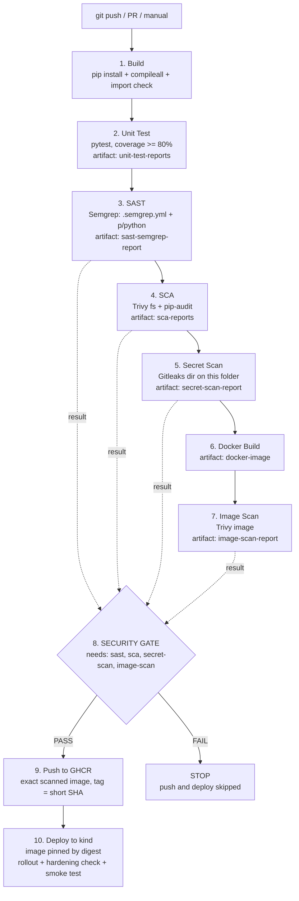

# Session 17 — DevSecOps

| | |
|---|---|
| **Student** | Rohan Singh |
| **Enrollment No.** | 24BCS10240 |
| **Session** | 17 — DevSecOps (secure CI/CD pipeline) |
| **Branch** | `main` |
| **Workflow file** | [`.github/workflows/24bcs10240-session17-devsecops.yml`](../../.github/workflows/24bcs10240-session17-devsecops.yml) |

## Task checklist

- [x] Pipeline in this exact order: **Build → Unit Test → SAST → SCA → Secret scan → Docker build → Image scan → Security gate → Push → Deploy**
- [x] SAST: **Semgrep**, custom rules in [`.semgrep.yml`](.semgrep.yml) plus the community `p/python` ruleset
- [x] SCA: **Trivy fs** (gating) and **pip-audit** (informational)
- [x] Secret scanning: **Gitleaks** with [`.gitleaks.toml`](.gitleaks.toml), scoped to this folder only
- [x] Container image scanning: **Trivy image** with [`trivy.yaml`](trivy.yaml), policy HIGH/CRITICAL
- [x] Security gate: one job that `needs` all four scans and fails on HIGH/CRITICAL, Semgrep ERROR, or any secret. It also fails closed if a scanner crashes.
- [x] Push to **GHCR** (`ghcr.io/rohansst/s17-devsecops-demo-24bcs10240`) with `GITHUB_TOKEN`, only after the gate passes
- [x] Deploy to Kubernetes (kind cluster in the runner). Manifests use `runAsNonRoot`, `readOnlyRootFilesystem`, drop ALL capabilities, resource limits, and readiness/liveness probes. The image is pinned by digest. Hardening is checked at runtime.
- [x] Scan reports (SARIF + JSON + text) uploaded as artifacts
- [x] Gate shown working: a **red run** (vulnerable dependency + debug mode + fake token) followed by a **green run** after the fix
- [x] Trivy run locally (installed with Homebrew), real output included
- [x] No `.trivyignore`: the image has 0 HIGH/CRITICAL findings, so nothing needs suppressing

---

## 1. Project layout

```text
session-17-devsecops/Rohan-24BCS10240/
├── app/main.py            # Flask API: /, /health, /api/status, /api/greet/<name>, /api/calc
├── tests/test_app.py      # 12 pytest tests (coverage gate 80%, currently 100%)
├── k8s/
│   ├── deployment.yaml    # hardened Deployment (securityContext, limits, probes, tmpfs /tmp)
│   └── service.yaml
├── Dockerfile             # multi-stage, python:3.12-alpine, pip removed, USER 10001
├── requirements.txt       # Flask, gunicorn (runtime)
├── requirements-dev.txt   # + pytest, pytest-cov
├── pytest.ini
├── .semgrep.yml           # SAST custom rules
├── .gitleaks.toml         # secret-scan config (default rules + custom rule)
├── trivy.yaml             # SCA + image scan policy
└── README.md
.github/workflows/24bcs10240-session17-devsecops.yml   # at repo root, where GitHub reads workflows
```

### Run locally

```bash
cd session-17-devsecops/Rohan-24BCS10240
python3 -m venv .venv && . .venv/bin/activate
pip install -r requirements-dev.txt
python -m pytest                                  # tests + coverage
docker build -t s17-devsecops-demo:local .
trivy image --config trivy.yaml s17-devsecops-demo:local
docker run --rm -p 8080:8080 --read-only --tmpfs /tmp --cap-drop ALL s17-devsecops-demo:local
curl -X POST localhost:8080/api/calc -H 'Content-Type: application/json' -d '{"op":"multiply","a":6,"b":7}'
```

---

## 2. Pipeline flow



### Gate design

Every scan job runs its tool in **report mode**. It always writes JSON, SARIF and text reports, uploads them as an artifact, and publishes two job outputs: `findings` (a count) and `result` (`pass`/`fail`). Findings appear as `::error` annotations on the file and line. Because the scan jobs don't stop the chain, **every scanner runs on every commit**, and the gate sees the whole picture instead of only the first failure.

The `security-gate` job uses `needs: [sast, sca, secret-scan, image-scan]` and `if: always()`. It fails if any check has `job != success` **or** `result != pass`:

| Check | Tool | Blocking policy |
|---|---|---|
| SAST | Semgrep | any finding with severity `ERROR` (WARNINGs are reported only) |
| SCA | Trivy fs | any `HIGH` or `CRITICAL` dependency CVE |
| Secrets | Gitleaks | any secret |
| Image | Trivy image | any `HIGH` or `CRITICAL` CVE (OS packages and Python packages; unfixed CVEs count too) |

It is **fail-closed**. If a scanner itself crashes, its job result is `failure` and the gate fails. That happened for real in run 37456596427 (see §5.2). `push` has `needs: security-gate`, and `deploy` has `needs: push`, so nothing reaches the registry or the cluster unless the gate passes.

`push` runs only on `push`/`workflow_dispatch` events (not on pull requests). It loads the **same image tarball that was scanned** from the `docker-image` artifact, so the image that gets pushed is byte-for-byte the image that was scanned. `deploy` pins the image by **digest** (`@sha256:…`), not by tag.

---

## 3. Tools and config files

### SAST: Semgrep (`.semgrep.yml`)
Semgrep reads source code without running it (pattern matching over the code's syntax tree). The pipeline runs `semgrep scan --config .semgrep.yml --config p/python app tests`. That is 156 rules: 5 custom ones plus the community Python ruleset.

| Custom rule | Severity | Catches |
|---|---|---|
| `s17-flask-debug-enabled` | ERROR | `app.run(debug=True)`, `app.debug = True` (Werkzeug debugger allows remote code execution, CWE-489) |
| `s17-subprocess-shell-true` | ERROR | `subprocess.*(shell=True)`, `os.system` (CWE-78) |
| `s17-unsafe-yaml-load` | ERROR | `yaml.load` without `SafeLoader` (CWE-502) |
| `s17-eval-exec` | ERROR | `eval` / `exec` (CWE-95) |
| `s17-hardcoded-credential` | WARNING | `password/secret/token/api_key = "..."` (CWE-798) |

### SCA: Trivy fs + pip-audit
- **Trivy fs** (gating): `trivy fs --config trivy.yaml .` reads `requirements.txt` and matches the pinned packages against the Trivy vulnerability DB (NVD, GitHub advisories, and others), which includes severities.
- **pip-audit** (informational): resolves the **full dependency tree** (including transitive packages) against the PyPI/OSV advisory DB. pip-audit reports no severity, so it would not fit a "HIGH/CRITICAL" policy. It raises a `::warning` and uploads `pip-audit.json`, and the gate does not use it. Transitive packages are still gated, because the image scan in step 7 sees every package installed in the image.

### Secret scanning: Gitleaks (`.gitleaks.toml`)
- `[extend] useDefault = true` keeps all built-in rules (AWS, GitHub, Slack, private keys, JWT, generic API keys, and so on).
- A custom rule `s17-demo-api-token` (`s17demo_[a-f0-9]{32}`) adds an organisation-specific token format. The red demo uses it, so it never needs a real-looking provider credential (which GitHub push protection would also block).
- **Scoped to this folder**: the job runs `gitleaks dir .` from `session-17-devsecops/Rohan-24BCS10240`. Other students' files in the shared repo are not scanned. `--redact` keeps the secret value out of the logs.
- Note: `dir` mode scans the current tree. After the fix commit the token no longer appears, but it is **still in git history** (commit `b053d7e`). For a real credential, deleting it is not enough: rotate or revoke it first, then clean the history (course §06). Here the token is fake and grants access to nothing.

### Container image scanning: Trivy (`trivy.yaml`)
```yaml
severity: [HIGH, CRITICAL]
exit-code: 1
scan: { scanners: [vuln] }
vulnerability: { ignore-unfixed: false }   # strict: unfixed CVEs count too
db: { repository: [mirror.gcr.io/aquasec/trivy-db] }
```
The same file drives the local scan, `trivy fs` and `trivy image`. In CI, `--exit-code 0` is passed so the job can always write its reports, and the gate applies the policy.

Trivy and Gitleaks are installed from their **GitHub release tarballs, checked against the published SHA-256 checksums**. The third-party `trivy-action` / `gitleaks-action` wrappers are not used.

### Why the base image is `python:3.12-alpine` (real local Trivy result)

I first tried the Debian slim base. Local scan (`trivy image --severity HIGH,CRITICAL`):

```text
python:3.12-slim (debian 13.7)
==============================
Total: 44 (HIGH: 44, CRITICAL: 0)
```

Those findings are in OS packages such as `util-linux`, `libsystemd0` and `ncurses`, most with status `affected` (no fix available). My first slim-based image also had 4 HIGH findings in `pip`/`setuptools` and their vendored `urllib3`/`msgpack`. Switching to `python:3.12-alpine`, running `apk upgrade` and **removing pip/setuptools from the runtime image** brought it to **0 HIGH/CRITICAL** without any `.trivyignore`.

---

## 4. Kubernetes hardening (`k8s/deployment.yaml`)

| Control | Setting |
|---|---|
| Non-root | pod and container `runAsNonRoot: true`, `runAsUser/runAsGroup: 10001` (the image also sets `USER 10001:10001`) |
| Read-only root FS | `readOnlyRootFilesystem: true`; only `/tmp` is writable (in-memory `emptyDir`, 16Mi) for gunicorn's worker heartbeat files |
| Privilege | `allowPrivilegeEscalation: false`, `privileged: false`, `capabilities.drop: [ALL]`, `seccompProfile: RuntimeDefault` |
| Resources | requests `50m / 64Mi`, limits `250m / 192Mi` |
| Probes | readiness and liveness on `GET /health` |
| API access | `automountServiceAccountToken: false` |
| Supply chain | image pinned by digest; private GHCR pull via `imagePullSecret` created from the job's `GITHUB_TOKEN` (`packages: read`) |

The deploy job **checks these settings on the running pod** (`kubectl get pod -o jsonpath=…securityContext`, `id`, and a `touch /app/...` that must fail). See §5.3.

The app adds `X-Content-Type-Options`, `X-Frame-Options` and `Content-Security-Policy` headers and HTML-escapes user input in `/api/greet/<name>`. gunicorn runs with `--no-control-socket`, because gunicorn 26 would otherwise try to create a socket in `$HOME`, which is read-only.

---

## 5. Execution evidence (real runs on the fork)

The excerpts below are copied from `gh run view <id> --log`, with timestamps removed.

| # | Commit | Result | Run |
|---|---|---|---|
| 1 | `29652de` Flask app, hardened Dockerfile/k8s, security configs, workflow | ✅ success, 10/10 jobs | [37455948323](https://github.com/RohanSingh0208/devops-heros/actions/runs/37455948323) |
| 2 | `b053d7e` **INTENTIONALLY insecure** (vulnerable dep, debug mode, fake token) | ❌ gate failed. Trivy `convert` crashed the SCA job, so the gate failed closed | [37456596427](https://github.com/RohanSingh0208/devops-heros/actions/runs/37456596427) |
| 3 | `df858d7` fix `trivy convert` exit code (insecure code still present) | ❌ **all four scans flagged it → Security Gate FAILED → push and deploy skipped** | [37456952216](https://github.com/RohanSingh0208/devops-heros/actions/runs/37456952216) |
| 4 | `9b2a457` remediate: drop vulnerable dep, debug mode and token | ✅ **gate PASSED → pushed → deployed** | [37457356020](https://github.com/RohanSingh0208/devops-heros/actions/runs/37457356020) |

### 5.1 Red run: the gate blocks the release ([run 37456952216](https://github.com/RohanSingh0208/devops-heros/actions/runs/37456952216))

The insecure commit added `requests==2.19.1` to `requirements.txt`, `app.run(host="0.0.0.0", port=8080, debug=True)` to `main.py`, and `app/settings.py` with `DEMO_API_TOKEN = "s17demo_<32 hex chars, redacted here>"`.

**Jobs**

```text
1. Build: success
2. Unit Test: success
3. SAST (Semgrep): success
4. SCA (pip-audit + Trivy fs): success
5. Secret Scan (Gitleaks): success
6. Docker Build: success
7. Container Image Scan (Trivy): success
8. Security Gate: failure
9. Push Image (GHCR): skipped
10. Deploy to Kubernetes (kind): skipped
```

**8. Security Gate**

```text
CHECK          JOB        RESULT   FINDINGS  VERDICT
SAST           success    fail     1         FAIL
SCA            success    fail     1         FAIL
Secrets        success    fail     1         FAIL
Image          success    fail     7         FAIL

##[error]Security gate FAILED - push and deploy are blocked
##[error]Process completed with exit code 1.
```

**3. SAST: Semgrep** (4 findings; 1 has severity ERROR, which blocks)

```text
    app/main.py
    ❯❱ python.flask.security.audit.app-run-param-config.avoid_app_run_with_bad_host
           85┆ app.run(host="0.0.0.0", port=8080, debug=True)
    ❯❱ python.flask.security.audit.debug-enabled.debug-enabled
           85┆ app.run(host="0.0.0.0", port=8080, debug=True)
   ❯❯❱ s17-flask-debug-enabled
           85┆ app.run(host="0.0.0.0", port=8080, debug=True)
    app/settings.py
    ❯❱ s17-hardcoded-credential
            4┆ DEMO_API_TOKEN = "s17demo_<redacted>"
 • Rules run: 156
Semgrep findings: total=4 blocking(ERROR)=1
##[error][s17-flask-debug-enabled] Flask debug mode exposes the Werkzeug interactive debugger (remote code execution). Never enable debug in code that ships; use FLASK_DEBUG locally instead.
```

**4. SCA: Trivy fs** (gating)

```text
requirements.txt (pip)
======================
Total: 1 (HIGH: 1, CRITICAL: 0)
│ requests │ CVE-2018-18074 │ HIGH     │ fixed  │ 2.19.1            │ 2.20.0        │ python-requests: Redirect from HTTPS to HTTP does not remove │
```

**4. SCA: pip-audit** (informational; full transitive tree, excerpt)

```text
Found 37 known vulnerabilities in 3 packages
Name     Version ID              Fix Versions
-------- ------- --------------- -------------
requests 2.19.1  PYSEC-2018-28   2.20.0
requests 2.19.1  PYSEC-2023-74   2.31.0
idna     2.7     PYSEC-2024-60   3.7
urllib3  1.23    PYSEC-2019-133  1.24.2
urllib3  1.23    PYSEC-2023-192  1.26.17,2.0.6
...
##[warning]pip-audit reported known vulnerabilities (see pip-audit.json)
```

**5. Secret scan: Gitleaks** (`--redact`)

```text
Finding:     DEMO_API_TOKEN = "REDACTED
Secret:      REDACTED
RuleID:      s17-demo-api-token
Entropy:     3.856198
Tags:        [custom demo]
File:        app/settings.py
Line:        4
Fingerprint: app/settings.py:s17-demo-api-token:4
INF scanned ~10995 bytes (10.99 KB) in 10.9ms
WRN leaks found: 1
Secrets found: 1
##[error]Gitleaks rule s17-demo-api-token: Session 17 demo API token
```

**7. Image scan: Trivy image** (it also finds the **transitive** `urllib3 1.23` that Trivy fs could not see)

```text
│ s17-devsecops-demo:df858d73000a2fccb6ecc37513ea54980fb303b6 (alpine 3.24.2) │   alpine   │        0        │
│ opt/venv/lib/python3.12/site-packages/requests-2.19.1.dist-info/METADATA    │ python-pkg │        1        │
│ opt/venv/lib/python3.12/site-packages/urllib3-1.23.dist-info/METADATA       │ python-pkg │        6        │

Python (python-pkg)
===================
Total: 7 (HIGH: 7, CRITICAL: 0)
│ requests (METADATA) │ CVE-2018-18074 │ HIGH │ fixed │ 2.19.1 │ 2.20.0         │ python-requests: Redirect from HTTPS to HTTP does not remove
│ urllib3 (METADATA)  │ CVE-2019-11324 │      │       │ 1.23   │ 1.24.2         │ python-urllib3: Certification mishandle when error should be thrown
│                     │ CVE-2023-43804 │      │       │        │ 2.0.6, 1.26.17 │ python-urllib3: Cookie request header isn't stripped during cross-origin redirects
│                     │ CVE-2025-66471 │      │       │        │ 2.6.0          │ urllib3: urllib3 Streaming API improperly handles highly compressed data
│                     │ CVE-2026-21441 │      │       │        │ 2.6.3          │ urllib3: urllib3 vulnerable to decompression-bomb safeguard bypass ...
│                     │ CVE-2026-44431 │      │       │        │ 2.7.0          │ urllib3: urllib3: Information disclosure via cross-origin redirects ...
│                     │ CVE-2026-97689 │      │       │        │ 2.8.0          │ urllib3: urllib3: Denial of Service via unbounded memory allocation ...
HIGH/CRITICAL image vulnerabilities: 7
```

### 5.2 Fail-closed in practice ([run 37456596427](https://github.com/RohanSingh0208/devops-heros/actions/runs/37456596427))

On the first push of the insecure commit, `trivy convert --format table` inherited `exit-code: 1` from `trivy.yaml` and exited 1 when it found the vulnerability. The **SCA job itself failed**, the following scan jobs were skipped, and the gate still failed, because it treats a job that did not succeed as FAIL:

```text
3. SAST (Semgrep): success        4. SCA (pip-audit + Trivy fs): failure
5. Secret Scan (Gitleaks): skipped   6. Docker Build: skipped   7. Container Image Scan (Trivy): skipped
8. Security Gate: failure         9. Push Image (GHCR): skipped   10. Deploy: skipped
gate env: SAST_RES=fail SAST_N=1  SCA_JOB=failure  SEC_JOB=skipped
```

Fix: `trivy convert --exit-code 0 …` (the gate job applies the policy). Run #3 then showed every scanner's report.

### 5.3 Green run after remediation ([run 37457356020](https://github.com/RohanSingh0208/devops-heros/actions/runs/37457356020), commit `9b2a457`)

```text
1. Build: success
2. Unit Test: success
3. SAST (Semgrep): success
4. SCA (pip-audit + Trivy fs): success
5. Secret Scan (Gitleaks): success
6. Docker Build: success
7. Container Image Scan (Trivy): success
8. Security Gate: success
9. Push Image (GHCR): success
10. Deploy to Kubernetes (kind): success
```

**1. Build / 2. Unit Test**

```text
routes: ['/', '/api/calc', '/api/greet/<name>', '/api/status', '/health', '/static/<path:filename>']
tests/test_app.py::test_index PASSED                                     [  8%]
tests/test_app.py::test_health PASSED                                    [ 16%]
tests/test_app.py::test_security_headers PASSED                          [ 25%]
tests/test_app.py::test_status PASSED                                    [ 33%]
tests/test_app.py::test_greet_escapes_html PASSED                        [ 41%]
tests/test_app.py::test_calc[add-2-3-5] PASSED                           [ 50%]
tests/test_app.py::test_calc[subtract-5-3-2] PASSED                      [ 58%]
tests/test_app.py::test_calc[multiply-4-5-20] PASSED                     [ 66%]
tests/test_app.py::test_calc[divide-9-3-3] PASSED                        [ 75%]
tests/test_app.py::test_calc_divide_by_zero PASSED                       [ 83%]
tests/test_app.py::test_calc_bad_input PASSED                            [ 91%]
tests/test_app.py::test_not_found PASSED                                 [100%]
app/main.py          43      0   100%
TOTAL                43      0   100%
Required test coverage of 80% reached. Total coverage: 100.00%
============================== 12 passed in 0.41s ==============================
```

**3–7. Scans**

```text
[SAST]    • Findings: 0 (0 blocking)   • Rules run: 156   Semgrep findings: total=0 blocking(ERROR)=0
[SCA]     pip-audit: No known vulnerabilities found
[SCA]     │ requirements.txt │ pip  │        0        │   HIGH/CRITICAL dependency vulnerabilities: 0
[Secrets] INF scanned ~10470 bytes (10.47 KB) in 8.11ms   INF no leaks found   Secrets found: 0
[Docker]  s17-devsecops-demo   9b2a457b928572740cf367f1fd71762fda1431bc   30ac0b1dbb9f   1 second ago   61.8MB
[Docker]  User=10001:10001 Cmd=[gunicorn --bind 0.0.0.0:8080 --workers 2 --worker-tmp-dir /tmp --no-control-socket --access-logfile - app.main:app]
[Image]   │ s17-devsecops-demo:9b2a457b928572740cf367f1fd71762fda1431bc (alpine 3.24.2) │   alpine   │        0        │
[Image]   HIGH/CRITICAL image vulnerabilities: 0
```

**8. Security Gate**

```text
CHECK          JOB        RESULT   FINDINGS  VERDICT
SAST           success    pass     0         PASS
SCA            success    pass     0         PASS
Secrets        success    pass     0         PASS
Image          success    pass     0         PASS

Security gate PASSED
```

**9. Push (GHCR)**

```text
The push refers to repository [ghcr.io/rohansst/s17-devsecops-demo-24bcs10240]
9b2a457: digest: sha256:6531f1f703d94cac627b0ef2594c24bd4d458b556450051b692b32b6f90a4bf5 size: 1991
```

**10. Deploy (kind)**

```text
29:          image: ghcr.io/rohansst/s17-devsecops-demo-24bcs10240@sha256:6531f1f703d94cac627b0ef2594c24bd4d458b556450051b692b32b6f90a4bf5
deployment.apps/s17-devsecops-demo created
service/s17-devsecops-demo created
Waiting for deployment "s17-devsecops-demo" rollout to finish: 0 of 2 updated replicas are available...
Waiting for deployment "s17-devsecops-demo" rollout to finish: 1 of 2 updated replicas are available...
deployment "s17-devsecops-demo" successfully rolled out
NAME                                 READY   UP-TO-DATE   AVAILABLE   AGE
deployment.apps/s17-devsecops-demo   2/2     2            2           10s
pod/s17-devsecops-demo-6ffb8497cd-w2cd4   1/1     Running   0          10s
pod/s17-devsecops-demo-6ffb8497cd-xssmv   1/1     Running   0          10s

[Verify runtime hardening]
pod: s17-devsecops-demo-6ffb8497cd-w2cd4
{
  "allowPrivilegeEscalation": false,
  "capabilities": { "drop": [ "ALL" ] },
  "privileged": false,
  "readOnlyRootFilesystem": true,
  "runAsNonRoot": true
}
{"limits":{"cpu":"250m","memory":"192Mi"},"requests":{"cpu":"50m","memory":"64Mi"}}
uid inside container: uid=10001(app) gid=10001(app) groups=10001(app)
write to /app blocked as expected: touch: /app/should-fail: Read-only file system

[Smoke test]
{"status":"ok"}
{"app":"s17-devsecops-demo","student":"Rohan Singh (24BCS10240)","version":"9b2a457"}
{"a":6.0,"b":7.0,"op":"multiply","result":42.0}
X-Content-Type-Options: nosniff
X-Frame-Options: DENY
```

### 5.4 Artifacts (`gh api repos/RohanSingh0208/devops-heros/actions/runs/<id>/artifacts`)

Green run 37457356020:

```text
image-scan-report  16221 bytes  id=11410990531     # trivy-image.json / .sarif / .txt
unit-test-reports  1139 bytes  id=11410740395      # junit.xml, coverage.xml
docker-image  22278932 bytes  id=11410640592       # image.tar.gz (the scanned image that was pushed)
secret-scan-report  7207 bytes  id=11410605723     # gitleaks.json / .sarif
sca-reports  1341 bytes  id=11410605677            # pip-audit.json, trivy-fs.json / .sarif
sast-semgrep-report  27853 bytes  id=11410430572   # semgrep.json / .sarif / .txt
```

Red run 37456952216 (reports with findings are larger):

```text
image-scan-report  27006 bytes  id=11410390194
secret-scan-report  7687 bytes  id=11410325087
sast-semgrep-report  30219 bytes  id=11410175093
docker-image  23192756 bytes  id=11409930352
sca-reports  12396 bytes  id=11409880306
unit-test-reports  1179 bytes  id=11409369574
```

---

## 6. Local Trivy scan (Homebrew `trivy` 0.75.0, final image)

```console
$ trivy --version
Version: 0.75.0
$ docker build -t s17-devsecops-demo:local .
$ trivy image --config trivy.yaml --no-progress s17-devsecops-demo:local ; echo "exit=$?"
INFO	Loaded	file_path="trivy.yaml"
INFO	[vuln] Vulnerability scanning is enabled
INFO	Detected OS	family="alpine" version="3.24.2"
INFO	[alpine] Detecting vulnerabilities...	os_version="3.24" repository="3.24" pkg_num=38
INFO	Number of language-specific files	num=1
INFO	[python-pkg] Detecting vulnerabilities...

Report Summary

┌─────────────────────────────────────────────────────────────────────────────┬────────────┬─────────────────┐
│                                   Target                                    │    Type    │ Vulnerabilities │
├─────────────────────────────────────────────────────────────────────────────┼────────────┼─────────────────┤
│ s17-devsecops-demo:local (alpine 3.24.2)                                    │   alpine   │        0        │
├─────────────────────────────────────────────────────────────────────────────┼────────────┼─────────────────┤
│ opt/venv/lib/python3.12/site-packages/blinker-1.9.0.dist-info/METADATA      │ python-pkg │        0        │
├─────────────────────────────────────────────────────────────────────────────┼────────────┼─────────────────┤
│ opt/venv/lib/python3.12/site-packages/click-8.5.0.dist-info/METADATA        │ python-pkg │        0        │
├─────────────────────────────────────────────────────────────────────────────┼────────────┼─────────────────┤
│ opt/venv/lib/python3.12/site-packages/flask-3.1.3.dist-info/METADATA        │ python-pkg │        0        │
├─────────────────────────────────────────────────────────────────────────────┼────────────┼─────────────────┤
│ opt/venv/lib/python3.12/site-packages/gunicorn-26.2.0.dist-info/METADATA    │ python-pkg │        0        │
├─────────────────────────────────────────────────────────────────────────────┼────────────┼─────────────────┤
│ opt/venv/lib/python3.12/site-packages/itsdangerous-2.2.0.dist-info/METADATA │ python-pkg │        0        │
├─────────────────────────────────────────────────────────────────────────────┼────────────┼─────────────────┤
│ opt/venv/lib/python3.12/site-packages/jinja2-3.1.6.dist-info/METADATA       │ python-pkg │        0        │
├─────────────────────────────────────────────────────────────────────────────┼────────────┼─────────────────┤
│ opt/venv/lib/python3.12/site-packages/markupsafe-3.0.4.dist-info/METADATA   │ python-pkg │        0        │
├─────────────────────────────────────────────────────────────────────────────┼────────────┼─────────────────┤
│ opt/venv/lib/python3.12/site-packages/werkzeug-3.1.9.dist-info/METADATA     │ python-pkg │        0        │
└─────────────────────────────────────────────────────────────────────────────┴────────────┴─────────────────┘
Legend:
- '-': Not scanned
- '0': Clean (no security findings detected)
exit=0
```

Local `trivy fs` on the insecure commit, before pushing it (it confirmed the red demo would trip SCA):

```console
$ trivy fs --config trivy.yaml --exit-code 0 .
│ requirements.txt │ pip  │        1        │
Total: 1 (HIGH: 1, CRITICAL: 0)
│ requests │ CVE-2018-18074 │ HIGH     │ fixed  │ 2.19.1            │ 2.20.0        │ python-requests: Redirect from HTTPS to HTTP does not remove │
```

---

## 7. Notes and limitations

- **kind** gives a real Kubernetes API server, scheduler and kubelet inside the GitHub runner, so `apply`, `rollout status`, `exec` and probes are real. The cluster is deleted when the job ends. A persistent cluster would replace the kind step with a kubeconfig stored as a secret.
- The annotation `The process '/usr/bin/git' failed with exit code 128` comes from `actions/checkout` post-job cleanup. It hits a broken submodule entry that already exists in the upstream repo (`session-16-github-actions/mini-project 10-33-34-265`). It is harmless and unrelated to this project.
- In §5.1 some wide Trivy table rows are condensed (padding and wrapped title lines removed) so they fit the page. The values are unchanged from the run log.
- The SARIF files are not uploaded to GitHub code scanning. They are kept as downloadable artifacts, so this demo does not add alerts to the shared fork's Security tab.
