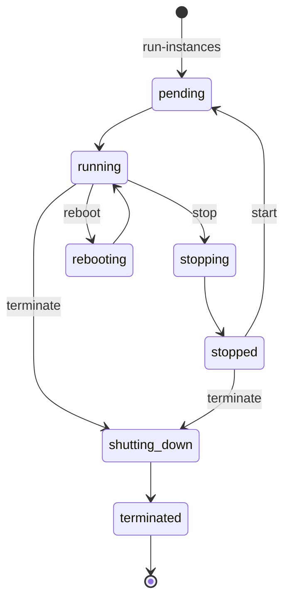

# 02 - Amazon EC2 (Elastic Compute Cloud)

- **Student:** Rohan Singh
- **Enrollment No.:** 24BCS10240
- **Session:** 18 - Terraform & IaC (Task 2: AWS core services)

## Checklist

- [x] What is EC2
- [x] AMI
- [x] Instance types
- [x] Key pairs
- [x] Security groups
- [x] EBS
- [x] Public vs private IP
- [x] Instance lifecycle
- [x] Use cases

---

## What is EC2?

EC2 provides **resizable virtual machines ("instances") in the cloud**. You choose the OS image, the CPU/RAM
size, storage, network and firewall rules, and pay per second (Linux) while it runs. It is the classic
**IaaS** building block: AWS manages the physical hosts and hypervisor (Nitro); you manage the OS and above.

```text
EC2 instance = AMI (what boots) + instance type (how big) + EBS (disks)
             + subnet/VPC (where) + security group (firewall) + key pair (how you log in)
             + IAM role (what it may call in AWS)
```

## AMI (Amazon Machine Image)

- Template used to launch an instance: root volume snapshot (OS + software), architecture
  (`x86_64` / `arm64`), virtualization type, block-device mapping and launch permissions.
- **Regional** - an AMI ID like `ami-0abcd...` exists in one region; copy it to use elsewhere.
- Sources: AWS-provided (Amazon Linux 2023, Ubuntu, Windows), **AWS Marketplace**, community, or your own
  ("golden image" built with Packer / `create-image`).
- In Terraform, look up the latest image instead of hard-coding IDs:

```hcl
data "aws_ami" "al2023" {
  most_recent = true
  owners      = ["amazon"]
  filter {
    name   = "name"
    values = ["al2023-ami-*-x86_64"]
  }
}
```

## Instance types

Name format: `family` + `generation` + `[attributes]` + `.size`, e.g. `t3.micro`, `m7g.large`, `c6i.2xlarge`
(`g` = Graviton/ARM, `i` = Intel, `a` = AMD, `n` = enhanced networking, `d` = local NVMe).

| Family | Optimised for | Examples |
|---|---|---|
| **T** (burstable) | low baseline CPU with burst credits | `t3.micro`, `t4g.small` - dev, small web apps |
| **M** (general purpose) | balanced CPU/RAM | `m7i.large` - app servers |
| **C** (compute) | high CPU per GB | `c7g.xlarge` - batch, gaming, encoding |
| **R / X** (memory) | lots of RAM | `r7i.2xlarge` - in-memory caches, big DBs |
| **I / D** (storage) | fast local NVMe / dense HDD | `i4i` - NoSQL, data warehouses |
| **P / G / Inf / Trn** (accelerated) | GPUs / ML chips | `g5`, `p5` - ML training/inference |

Pricing models: **On-Demand**, **Savings Plans / Reserved** (1-3 yr commit, up to ~72% off),
**Spot** (spare capacity, up to ~90% off, can be reclaimed with 2-min notice), **Dedicated Hosts**.

## Key pairs

- An SSH **public key** stored by AWS and injected into the instance at first boot
  (`~/.ssh/authorized_keys` of `ec2-user`/`ubuntu`); you keep the **private key** (`.pem`).
- AWS shows the private key **only once** at creation. Lose it -> you can't SSH with it.
- Types: RSA or ED25519. You can also import your own public key (`aws ec2 import-key-pair`).
- Alternatives without opening port 22: **EC2 Instance Connect** and **SSM Session Manager**.

```bash
aws ec2 create-key-pair --key-name rohan-key --query KeyMaterial --output text > rohan-key.pem
chmod 400 rohan-key.pem
ssh -i rohan-key.pem ec2-user@<public-ip>
```

## Security groups

- A **stateful virtual firewall** attached to the instance's network interface (ENI).
- Contains **allow rules only** (no deny). Default: all inbound denied, all outbound allowed.
- **Stateful** = response traffic for an allowed request is automatically allowed back.
- Sources can be CIDRs or **other security groups** (e.g. "DB SG allows 5432 only from App SG").
- Up to 5 SGs per ENI; changes apply immediately.

```hcl
resource "aws_security_group" "web" {
  name   = "web-sg"
  vpc_id = aws_vpc.main.id

  ingress {
    from_port   = 80
    to_port     = 80
    protocol    = "tcp"
    cidr_blocks = ["0.0.0.0/0"]
  }
  ingress {
    from_port   = 22
    to_port     = 22
    protocol    = "tcp"
    cidr_blocks = ["203.0.113.10/32"] # only my IP, never 0.0.0.0/0
  }
  egress {
    from_port   = 0
    to_port     = 0
    protocol    = "-1"
    cidr_blocks = ["0.0.0.0/0"]
  }
}
```

## EBS (Elastic Block Store)

- Network-attached **block storage** volumes for EC2 - like a virtual hard disk.
- Lives in **one Availability Zone**; can be attached to instances in that AZ (normally one at a time).
- **Persists independently** of the instance (root volume is deleted on termination by default -
  `DeleteOnTermination`, data volumes are not).
- Volume types: `gp3` (general SSD, default choice), `io2` (provisioned IOPS for databases),
  `st1` (throughput HDD), `sc1` (cold HDD).
- **Snapshots** = incremental backups stored in S3 (regional); used to create new volumes/AMIs and copy across regions.
- Encryption with KMS can be enabled per volume or account-wide by default.
- Contrast: **instance store** = local disk on the host, very fast but **lost on stop/terminate**.

## Public vs private IP

| | Private IP | Public IP | Elastic IP |
|---|---|---|---|
| From | subnet CIDR (e.g. `10.0.1.25`) | AWS public pool | AWS public pool, allocated to *your account* |
| Reachable from | inside the VPC / peered / VPN | the internet (via the IGW) | the internet |
| Lifetime | stays for the life of the instance | **changes on stop/start** | static until you release it |
| Cost | free | charged per hour (all public IPv4) | charged per hour |

The instance's OS only ever sees its private IP; the **Internet Gateway performs 1:1 NAT** between public
and private IP. To get a public IP automatically, launch in a subnet with `map_public_ip_on_launch = true`
(or set `associate_public_ip_address`).

## Instance lifecycle



- **pending** - being provisioned; not billed yet.
- **running** - billed for compute.
- **stopped** - (EBS-backed only) no compute charge, EBS still billed; may move to a new host on start; public IP released.
- **hibernate** - like stop, but RAM is saved to the EBS root volume.
- **reboot** - same host, keeps IPs and instance store.
- **terminated** - deleted permanently; root volume deleted (by default). Protect with `disable_api_termination`.

## Use cases

- Web/application servers (often behind an ALB in an Auto Scaling Group).
- Self-managed databases or software that needs OS-level control.
- CI/CD build agents, batch processing, HPC (with Spot for cost).
- GPU instances for ML training/inference.
- Bastion hosts, VPN servers, lift-and-shift migrations of on-prem VMs.

---

## Hands-on (run against LocalStack, an AWS emulator)

Run against LocalStack 3.8 (`--endpoint-url http://localhost:4566` omitted from displayed commands).
EC2 in LocalStack community is **mocked**: API calls succeed and resources are recorded, but no VM really boots.

```text
$ aws ec2 create-key-pair --key-name rohan-key --query KeyName --output text
rohan-key

$ aws ec2 describe-instance-types --instance-types t3.micro --query "InstanceTypes[].{Type:InstanceType,vCPU:VCpuInfo.DefaultVCpus,MemMiB:MemoryInfo.SizeInMiB}" --output table
--------------------------------
|     DescribeInstanceTypes    |
+--------+------------+--------+
| MemMiB |   Type     | vCPU   |
+--------+------------+--------+
|  1024  |  t3.micro  |  2     |
+--------+------------+--------+
```

A full Terraform VPC + EC2 (nginx via `user_data`) project is in the Session 19 submission.
