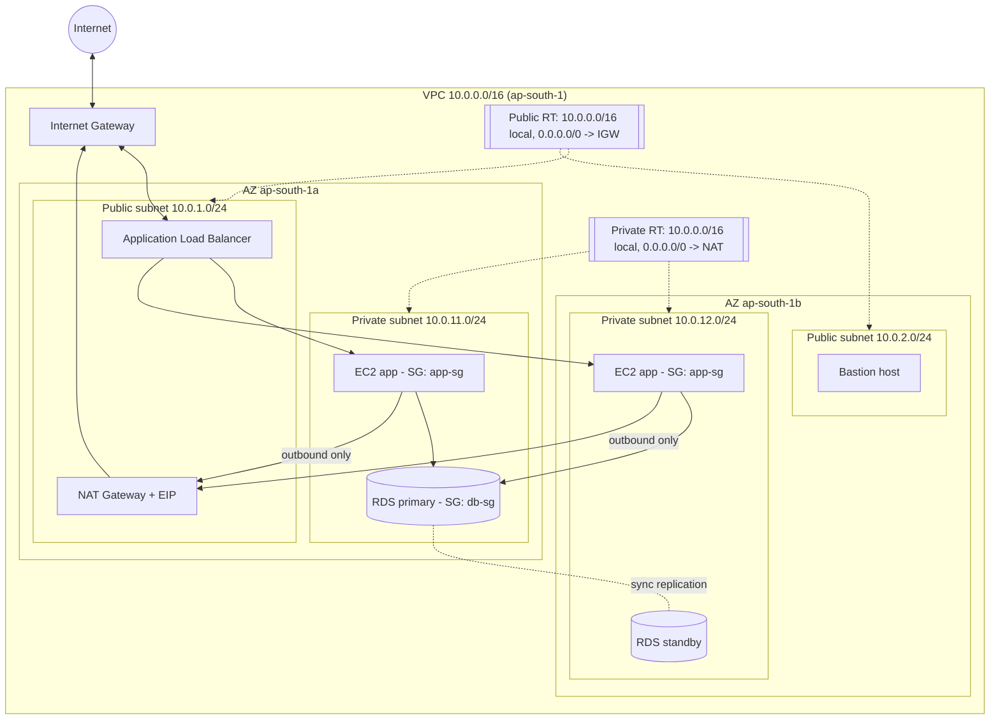

# 04 - Amazon VPC (Virtual Private Cloud)

- **Student:** Rohan Singh
- **Enrollment No.:** 24BCS10240
- **Session:** 18 - Terraform & IaC (Task 2: AWS core services)

## Checklist

- [x] What is a VPC
- [x] CIDR
- [x] Subnets
- [x] Route tables
- [x] Internet Gateway
- [x] NAT Gateway
- [x] Security groups
- [x] NACLs
- [x] Public vs private subnet
- [x] Architecture diagram (mermaid)

---

## What is a VPC?

A VPC is your own **logically isolated private network inside an AWS region**. You choose its IP range,
split it into subnets across Availability Zones, and control routing and firewalls. Resources such as EC2,
RDS, Lambda (in VPC mode), EKS nodes and load balancers live inside it. Each region has a **default VPC**
(`172.31.0.0/16`) but real workloads use custom VPCs.

## CIDR

**CIDR** (Classless Inter-Domain Routing) notation = base address + prefix length, e.g. `10.0.0.0/16`:
the first 16 bits are fixed (network), the remaining 16 bits are hosts -> 2^16 = 65,536 addresses.

| CIDR | Addresses | Typical use |
|---|---|---|
| `/16` | 65,536 | VPC (largest allowed) |
| `/20` | 4,096 | large subnet |
| `/24` | 256 (251 usable in AWS) | typical subnet |
| `/28` | 16 (11 usable) | smallest allowed |

- Use private RFC 1918 ranges: `10.0.0.0/8`, `172.16.0.0/12`, `192.168.0.0/16`.
- **Plan ranges so they don't overlap** with other VPCs/on-prem networks you may peer or VPN with.
- AWS reserves **5 IPs per subnet**: network address, `.1` VPC router, `.2` DNS, `.3` future use, broadcast.
- Terraform helper: `cidrsubnet("10.0.0.0/16", 8, 1)` -> `10.0.1.0/24`.

## Subnets

- A subnet is a slice of the VPC CIDR that lives in **exactly one Availability Zone**.
- Spread subnets across >= 2 AZs for high availability.
- Whether a subnet is "public" or "private" depends only on its **route table** (see below).
- `map_public_ip_on_launch = true` makes instances in it get a public IPv4 automatically.

## Route tables

- A set of rules: **destination CIDR -> target** (IGW, NAT GW, peering, TGW, VPC endpoint, ENI ...).
- Every route table has an implicit **`local`** route for the VPC CIDR (all subnets can talk to each other).
- Each subnet is associated with exactly one route table (or falls back to the VPC's **main** route table).
- Most-specific prefix wins (longest prefix match).

| Destination | Target | Meaning |
|---|---|---|
| `10.0.0.0/16` | local | intra-VPC traffic |
| `0.0.0.0/0` | `igw-...` | everything else -> internet (public subnet) |
| `0.0.0.0/0` | `nat-...` | everything else -> NAT GW (private subnet) |

## Internet Gateway (IGW)

- Horizontally scaled, highly available VPC component that connects the VPC to the internet. One per VPC; free.
- Does **1:1 NAT** between an instance's private IP and its public/Elastic IP.
- Two requirements for internet access: (1) route `0.0.0.0/0 -> igw` in the subnet's route table,
  (2) the instance has a public IP; plus SG/NACL must allow the traffic.

## NAT Gateway

- Lets instances in **private** subnets make **outbound** connections (OS updates, API calls) while staying
  **unreachable from the internet** (no inbound connections initiated from outside).
- Lives in a **public** subnet, has an **Elastic IP**, and private route tables send `0.0.0.0/0` to it.
- Managed, AZ-scoped -> for HA deploy one per AZ. Charged per hour + per GB processed (a common cost surprise).
- Alternatives: NAT instance (cheap, self-managed), **VPC endpoints** for AWS services (S3/DynamoDB gateway endpoints are free).

## Security groups (instance-level firewall)

- Attached to ENIs; **stateful**; **allow rules only**; all rules evaluated together.
- Can reference other SGs as source (e.g. DB SG allows 5432 from the App SG).

## NACLs (Network Access Control Lists - subnet-level firewall)

- Attached to **subnets**; **stateless** (you must allow return traffic, i.e. ephemeral ports `1024-65535`).
- Support **allow and deny** rules; evaluated **in order by rule number**, first match wins; final `*` rule denies.
- Default NACL allows everything; custom NACLs deny everything until you add rules.
- Good for coarse guardrails like blocking a malicious IP range for an entire subnet.

| | Security Group | NACL |
|---|---|---|
| Level | ENI / instance | subnet |
| State | stateful | stateless |
| Rules | allow only | allow + deny |
| Evaluation | all rules | numbered order, first match |
| Default | deny in, allow out | default NACL allows all |

## Public vs private subnet

| | Public subnet | Private subnet |
|---|---|---|
| Default route | `0.0.0.0/0 -> Internet Gateway` | `0.0.0.0/0 -> NAT Gateway` (or none) |
| Public IP on instances | yes | no |
| Reachable from internet | yes (if SG/NACL allow) | no |
| Typical resources | ALB, NAT GW, bastion host | app servers, databases, caches |

## Architecture diagram



## Terraform snippet (core pieces)

```hcl
resource "aws_vpc" "main" {
  cidr_block           = "10.0.0.0/16"
  enable_dns_hostnames = true
}

resource "aws_subnet" "public" {
  vpc_id                  = aws_vpc.main.id
  cidr_block              = cidrsubnet(aws_vpc.main.cidr_block, 8, 1) # 10.0.1.0/24
  availability_zone       = "ap-south-1a"
  map_public_ip_on_launch = true
}

resource "aws_internet_gateway" "igw" {
  vpc_id = aws_vpc.main.id
}

resource "aws_route_table" "public" {
  vpc_id = aws_vpc.main.id
  route {
    cidr_block = "0.0.0.0/0"
    gateway_id = aws_internet_gateway.igw.id
  }
}

resource "aws_route_table_association" "public" {
  subnet_id      = aws_subnet.public.id
  route_table_id = aws_route_table.public.id
}
```

A complete, applied version of this (VPC + public/private subnets + IGW + route tables + SG + EC2 + S3) with
real output is in the Session 19 submission (`session19-cloud-terraform/Rohan-24BCS10240/`).
