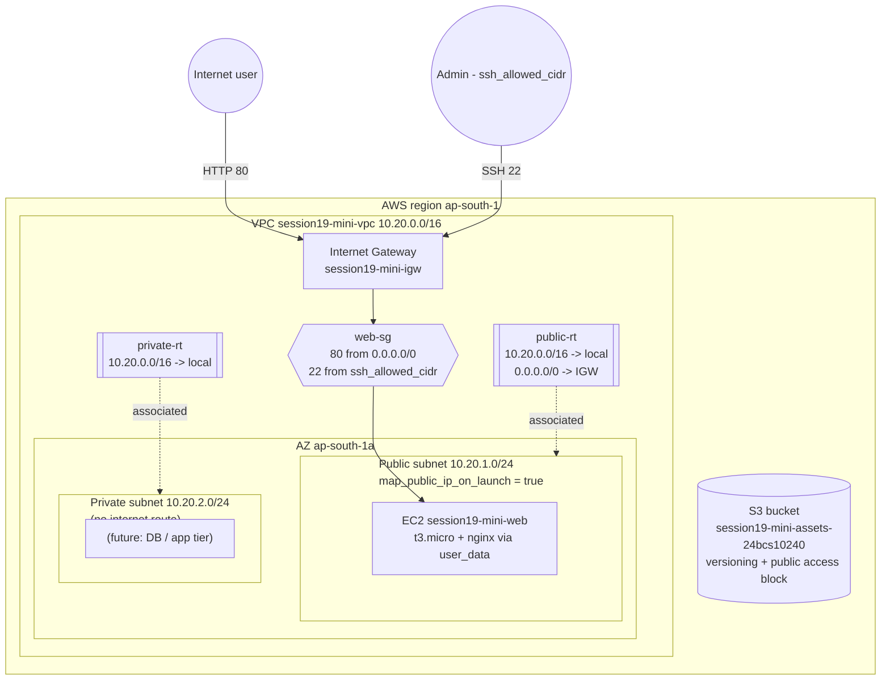
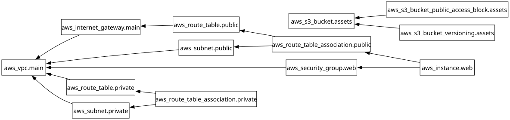

# Session 19 - Cloud & Terraform in Action (Mini Project)

- **Student:** Rohan Singh
- **Enrollment No.:** 24BCS10240
- **Session:** 19 - Cloud & Terraform in Action

## Task Checklist

- [x] End-to-end Terraform project following the `08-mini-project` spec (VPC `10.20.0.0/16`, public subnet `10.20.1.0/24`, IGW, public route table + association, web security group, same resource names and outputs)
- [x] Extra: private subnet `10.20.2.0/24` with its own route table
- [x] Security group: HTTP 80 from anywhere, **SSH 22 only from `var.ssh_allowed_cidr`**
- [x] EC2 instance in the public subnet, `user_data` installs nginx, AMI passed as a variable (optional extension of 08-mini-project)
- [x] S3 bucket (versioning + public access block)
- [x] Providers - AWS provider switchable between LocalStack and real AWS
- [x] Variables **with validation** (region, CIDRs, SSH CIDR not `0.0.0.0/0`, AMI format, allowed instance types) - validation failure demonstrated
- [x] Resources + outputs
- [x] Implicit dependencies (references) and an explicit `depends_on`
- [x] State: `terraform state list`, `terraform state show`, remote state + locking explained with a commented S3 backend (`backend.tf`)
- [x] `terraform init`, `fmt`, `validate`, `plan`, `apply`, `output`, `plan -destroy`, `destroy` - all with real output
- [x] `terraform graph` rendered to SVG with Graphviz ([`docs/graph.svg`](docs/graph.svg), source [`docs/graph.dot`](docs/graph.dot))
- [x] Architecture diagram (mermaid)
- [x] AWS CLI verification (the 08-mini-project queries + more)
- [x] Answers to the 08-mini-project EC2 questions and interview questions

> **Where this ran:** every `apply`/`destroy` and AWS CLI command below ran against **LocalStack 3.8.1 community
> edition** - a local AWS emulator in Docker at `http://localhost:4566` - **not a real AWS account**. All output is
> real and copied from those runs (long output trimmed with `...`). **EC2 in LocalStack community is mocked**: the
> API records the instance, its IPs and `user_data`, but **no VM boots, so nginx is never actually installed and
> the public IP is fake/unreachable** (shown honestly in the `curl` check below). See
> [Real AWS vs LocalStack](#real-aws-vs-localstack).

Tools: Terraform `v1.16.4`, `hashicorp/aws` `v6.20.0` (locked in `.terraform.lock.hcl`), aws-cli `2.37.9`, Graphviz `dot`.

---

## Architecture



## Project structure

```text
Rohan-24BCS10240/
|-- README.md
|-- versions.tf               # terraform{} + required_providers + provider "aws" (LocalStack switch)
|-- variables.tf              # inputs with validation blocks
|-- main.tf                   # VPC, subnets, IGW, route tables, SG, EC2, S3
|-- outputs.tf                # vpc_id, vpc_cidr, subnet_id, security_group_id, instance + bucket outputs
|-- backend.tf                # commented-out S3 remote backend example (state + locking)
|-- terraform.tfvars.example  # copy to terraform.tfvars (git-ignored)
|-- scripts/user_data.sh      # nginx bootstrap, rendered with templatefile()
|-- docs/graph.dot, graph.svg # terraform graph output
|-- .terraform.lock.hcl       # committed provider lock
`-- .gitignore
```

## Terraform concepts demonstrated

### Provider

`versions.tf` pins Terraform `>= 1.6.0` and the AWS provider, then configures it. One flag decides the target:

```hcl
provider "aws" {
  region = var.aws_region

  access_key = var.use_localstack ? "test" : null
  secret_key = var.use_localstack ? "test" : null

  skip_credentials_validation = var.use_localstack
  skip_metadata_api_check     = var.use_localstack
  skip_requesting_account_id  = var.use_localstack
  s3_use_path_style           = var.use_localstack

  dynamic "endpoints" {
    for_each = var.use_localstack ? [1] : []
    content {
      ec2 = var.localstack_endpoint
      s3  = var.localstack_endpoint
      iam = var.localstack_endpoint
      sts = var.localstack_endpoint
    }
  }

  default_tags { tags = { Project = var.project_name, Session = "19", Owner = "24BCS10240", ManagedBy = "Terraform" } }
}
```

**Why the provider is pinned to `>= 6.0, < 6.21`:** with the latest 6.x (6.67.0) the provider sends bucket tags
*inside* the `CreateBucket` request (the newer S3 ABAC API). LocalStack 3.8 didn't reliably store them, so the
bucket ended up with no tags and every `plan` showed a tag diff. I checked this in the provider debug log
(`<CreateBucketConfiguration>...<Tags>` in the request, no `PutBucketTagging` call). Version 6.20.0 tags buckets with a separate
`PutBucketTagging` call, and after that every plan came back clean (`No changes`). On real AWS you can remove the upper bound.

### Variables with validation

Examples from `variables.tf`:

```hcl
variable "ssh_allowed_cidr" {
  type = string
  validation {
    condition     = can(cidrhost(var.ssh_allowed_cidr, 0)) && var.ssh_allowed_cidr != "0.0.0.0/0"
    error_message = "ssh_allowed_cidr must be a valid CIDR and must NOT be 0.0.0.0/0 (SSH open to the world)."
  }
}

variable "instance_type" {
  type    = string
  default = "t3.micro"
  validation {
    condition     = contains(["t2.micro", "t3.micro", "t3.small", "t4g.micro"], var.instance_type)
    error_message = "instance_type must be one of t2.micro, t3.micro, t3.small, t4g.micro."
  }
}
```

The other validations check that `aws_region` looks like a region name, that `vpc_cidr` is a valid /16-/28 CIDR,
that the subnet CIDRs are valid, that `ami_id` matches `ami-xxxxxxxx`, and that `project_name` is lowercase.

Validation in action (real output):

```text
$ terraform plan -var 'ssh_allowed_cidr=0.0.0.0/0'
...
Error: Invalid value for variable

  on variables.tf line 68:
  68: variable "ssh_allowed_cidr" {
    ├────────────────
    │ var.ssh_allowed_cidr is "0.0.0.0/0"

ssh_allowed_cidr must be a valid CIDR and must NOT be 0.0.0.0/0 (SSH open to
the world).

This was checked by the validation rule at variables.tf:72,3-13.
$ echo "exit code: $?"
exit code: 1

$ terraform plan -var 'instance_type=m5.24xlarge'
...
Error: Invalid value for variable

  on variables.tf line 88:
  88: variable "instance_type" {
    ├────────────────
    │ var.instance_type is "m5.24xlarge"

instance_type must be one of t2.micro, t3.micro, t3.small, t4g.micro.

This was checked by the validation rule at variables.tf:93,3-13.
```

### Implicit vs explicit dependencies

- **Implicit**: when a resource refers to another resource's attribute, Terraform knows the order. For example,
  `aws_subnet.public` uses `vpc_id = aws_vpc.main.id`, and `aws_instance.web` uses `subnet_id = aws_subnet.public.id`
  and `vpc_security_group_ids = [aws_security_group.web.id]`.
- **Explicit (`depends_on`)**: `aws_instance.web` doesn't reference the IGW or the public route table. But its
  `user_data` runs `dnf/apt install nginx` at first boot, and that needs a working `0.0.0.0/0 -> IGW` route.
  Terraform can't see that dependency from the code, so I declared it:

```hcl
resource "aws_instance" "web" {
  ...
  depends_on = [
    aws_internet_gateway.main,
    aws_route_table_association.public,
  ]
}
```

The apply log shows this order: `aws_instance.web: Creating...` starts only **after**
`aws_route_table_association.public: Creation complete`. Resources with no dependencies on each other (the S3
bucket and the VPC) were created **in parallel**.

### Outputs

`outputs.tf` keeps the four outputs the 08-mini-project expects (`vpc_id`, `vpc_cidr`, `subnet_id`,
`security_group_id`) and adds `private_subnet_id`, `instance_id`, `instance_public_ip`, `web_url` and `s3_bucket_name`.

---

## Run it

### 0. Variables

```bash
cp terraform.tfvars.example terraform.tfvars   # terraform.tfvars is git-ignored
```

Values used: region `ap-south-1`, `use_localstack = true`, `ssh_allowed_cidr = "203.0.113.10/32"` (a documentation
example IP - on real AWS use your own `/32`), `ami_id = "ami-760aaa0f"` (an Amazon Linux image from LocalStack's
mock AMI catalog), `instance_type = "t3.micro"`.

### 1. `terraform init`

```text
$ terraform init
Initializing the backend...

Initializing provider plugins...
- Finding hashicorp/aws versions matching ">= 6.0.0, < 6.21.0"...
- Installing hashicorp/aws v6.20.0...
- Installed hashicorp/aws v6.20.0 (signed by HashiCorp)

Terraform has created a lock file .terraform.lock.hcl to record the provider
selections it made above. Include this file in your version control repository
so that Terraform can guarantee to make the same selections by default when
you run "terraform init" in the future.

Terraform has been successfully initialized!
...
```

### 2. `terraform fmt`

After I added the version-pin comment, `fmt` re-aligned `versions.tf`:

```text
$ terraform fmt -diff
versions.tf
--- old/versions.tf
+++ new/versions.tf
@@ -3,7 +3,7 @@
 
   required_providers {
     aws = {
-      source  = "hashicorp/aws"
+      source = "hashicorp/aws"
       # Upper bound for LocalStack 3.8 compatibility: newer 6.x releases send
       # bucket tags inside CreateBucket (S3 ABAC), which LocalStack 3.8 does
       # not reliably store -> tags missing + perpetual diff. 6.20 tags buckets

$ terraform fmt -check; echo "exit $?"
exit 0
```

### 3. `terraform validate`

```text
$ terraform validate
Success! The configuration is valid.
```

### 4. `terraform plan`

I saved the plan to a file so `apply` runs exactly what was reviewed:

```text
$ terraform plan -out=session19.tfplan

Terraform used the selected providers to generate the following execution
plan. Resource actions are indicated with the following symbols:
  + create

Terraform will perform the following actions:

  # aws_instance.web will be created
  + resource "aws_instance" "web" {
      + ami                                  = "ami-760aaa0f"
      + arn                                  = (known after apply)
      + associate_public_ip_address          = (known after apply)
      ...
      + instance_type                        = "t3.micro"
      ...
      + public_ip                            = (known after apply)
      + region                               = "ap-south-1"
      ...
      + user_data                            = <<-EOT
            #!/bin/bash
            # Runs once at first boot (cloud-init). Installs nginx and a tiny landing page.
            set -euxo pipefail
            ...
            cat > /usr/share/nginx/html/index.html <<'HTML'
            <h1>session19-mini</h1>
            <p>Deployed with Terraform by Rohan Singh (24BCS10240)</p>
            HTML
            ...
            systemctl enable --now nginx
        EOT
      + user_data_replace_on_change          = true
      + vpc_security_group_ids               = (known after apply)
      ...
      + root_block_device {
          + delete_on_termination = true
          + encrypted             = true
          + volume_size           = 8
          + volume_type           = "gp3"
          ...
        }
    }

  # aws_internet_gateway.main will be created
  + resource "aws_internet_gateway" "main" {
      ...
      + tags     = {
          + "Name" = "session19-mini-igw"
        }
      + vpc_id   = (known after apply)
    }

  # aws_route_table.private will be created
  + resource "aws_route_table" "private" { ... }

  # aws_route_table.public will be created
  + resource "aws_route_table" "public" {
      ...
      + route            = [
          + {
              + cidr_block                 = "0.0.0.0/0"
              + gateway_id                 = (known after apply)
                # (11 unchanged attributes hidden)
            },
        ]
      + tags             = {
          + "Name" = "session19-mini-public-rt"
        }
      ...
    }

  # aws_route_table_association.private will be created
  # aws_route_table_association.public will be created
  # aws_s3_bucket.assets will be created
  + resource "aws_s3_bucket" "assets" {
      + bucket                      = "session19-mini-assets-24bcs10240"
      + force_destroy               = true
      ...
    }

  # aws_s3_bucket_public_access_block.assets will be created
  # aws_s3_bucket_versioning.assets will be created

  # aws_security_group.web will be created
  + resource "aws_security_group" "web" {
      + description            = "HTTP from anywhere, SSH only from ssh_allowed_cidr"
      ...
      + ingress                = [
          + {
              + cidr_blocks      = [
                  + "0.0.0.0/0",
                ]
              + description      = "HTTP"
              + from_port        = 80
              ...
              + to_port          = 80
            },
          + {
              + cidr_blocks      = [
                  + "203.0.113.10/32",
                ]
              + description      = "SSH from trusted CIDR only"
              + from_port        = 22
              ...
              + to_port          = 22
            },
        ]
      + name                   = "session19-mini-web-sg"
      ...
    }

  # aws_subnet.private will be created
  + resource "aws_subnet" "private" {
      + availability_zone                              = "ap-south-1a"
      + cidr_block                                     = "10.20.2.0/24"
      + map_public_ip_on_launch                        = false
      ...
    }

  # aws_subnet.public will be created
  + resource "aws_subnet" "public" {
      + availability_zone                              = "ap-south-1a"
      + cidr_block                                     = "10.20.1.0/24"
      + map_public_ip_on_launch                        = true
      ...
    }

  # aws_vpc.main will be created
  + resource "aws_vpc" "main" {
      + cidr_block                           = "10.20.0.0/16"
      + enable_dns_hostnames                 = true
      + enable_dns_support                   = true
      ...
      + tags_all                             = {
          + "ManagedBy" = "Terraform"
          + "Name"      = "session19-mini-vpc"
          + "Owner"     = "24BCS10240"
          + "Project"   = "session19-mini"
          + "Session"   = "19"
        }
    }

Plan: 13 to add, 0 to change, 0 to destroy.

Changes to Outputs:
  + instance_id        = (known after apply)
  + instance_public_ip = (known after apply)
  + private_subnet_id  = (known after apply)
  + s3_bucket_name     = "session19-mini-assets-24bcs10240"
  + security_group_id  = (known after apply)
  + subnet_id          = (known after apply)
  + vpc_cidr           = "10.20.0.0/16"
  + vpc_id             = (known after apply)
  + web_url            = (known after apply)

─────────────────────────────────────────────────────────────────────────────

Saved the plan to: session19.tfplan

To perform exactly these actions, run the following command to apply:
    terraform apply "session19.tfplan"
```

### 5. `terraform apply`

```text
$ terraform apply session19.tfplan
aws_vpc.main: Creating...
aws_s3_bucket.assets: Creating...
aws_s3_bucket.assets: Creation complete after 0s [id=session19-mini-assets-24bcs10240]
aws_s3_bucket_public_access_block.assets: Creating...
aws_s3_bucket_versioning.assets: Creating...
aws_s3_bucket_public_access_block.assets: Creation complete after 0s [id=session19-mini-assets-24bcs10240]
aws_s3_bucket_versioning.assets: Creation complete after 1s [id=session19-mini-assets-24bcs10240]
aws_vpc.main: Still creating... [00m10s elapsed]
aws_vpc.main: Creation complete after 10s [id=vpc-8be5cb99]
aws_internet_gateway.main: Creating...
aws_route_table.private: Creating...
aws_subnet.private: Creating...
aws_subnet.public: Creating...
aws_security_group.web: Creating...
aws_subnet.private: Creation complete after 0s [id=subnet-06ae7a59]
aws_internet_gateway.main: Creation complete after 0s [id=igw-f9e3d92b]
aws_route_table.public: Creating...
aws_route_table.private: Creation complete after 0s [id=rtb-175a86e7]
aws_route_table_association.private: Creating...
aws_route_table_association.private: Creation complete after 0s [id=rtbassoc-aa948e63]
aws_security_group.web: Creation complete after 0s [id=sg-78ad7a8b60988c9d9]
aws_route_table.public: Creation complete after 0s [id=rtb-9f218616]
aws_subnet.public: Still creating... [00m10s elapsed]
aws_subnet.public: Creation complete after 10s [id=subnet-5ee84231]
aws_route_table_association.public: Creating...
aws_route_table_association.public: Creation complete after 0s [id=rtbassoc-7a4dfe82]
aws_instance.web: Creating...
aws_instance.web: Still creating... [00m10s elapsed]
aws_instance.web: Creation complete after 10s [id=i-2e00aa341d5476e93]

Apply complete! Resources: 13 added, 0 changed, 0 destroyed.

Outputs:

instance_id = "i-2e00aa341d5476e93"
instance_public_ip = "54.214.183.10"
private_subnet_id = "subnet-06ae7a59"
s3_bucket_name = "session19-mini-assets-24bcs10240"
security_group_id = "sg-78ad7a8b60988c9d9"
subnet_id = "subnet-5ee84231"
vpc_cidr = "10.20.0.0/16"
vpc_id = "vpc-8be5cb99"
web_url = "http://54.214.183.10"
```

Then I ran `plan` again to check for drift:

```text
$ terraform plan -detailed-exitcode
...
No changes. Your infrastructure matches the configuration.

Terraform has compared your real infrastructure against your configuration
and found no differences, so no changes are needed.
$ echo $?
0
```

### 6. `terraform output`

```text
$ terraform output
instance_id = "i-2e00aa341d5476e93"
instance_public_ip = "54.214.183.10"
private_subnet_id = "subnet-06ae7a59"
s3_bucket_name = "session19-mini-assets-24bcs10240"
security_group_id = "sg-78ad7a8b60988c9d9"
subnet_id = "subnet-5ee84231"
vpc_cidr = "10.20.0.0/16"
vpc_id = "vpc-8be5cb99"
web_url = "http://54.214.183.10"
```

### 7. State: `terraform state list` / `terraform state show`

```text
$ terraform state list
aws_instance.web
aws_internet_gateway.main
aws_route_table.private
aws_route_table.public
aws_route_table_association.private
aws_route_table_association.public
aws_s3_bucket.assets
aws_s3_bucket_public_access_block.assets
aws_s3_bucket_versioning.assets
aws_security_group.web
aws_subnet.private
aws_subnet.public
aws_vpc.main
```

All six resources the 08-mini-project expects are there, plus the private subnet and route table, the EC2 instance and the S3 resources.

```text
$ terraform state show aws_security_group.web
# aws_security_group.web:
resource "aws_security_group" "web" {
    arn                    = "arn:aws:ec2:ap-south-1:000000000000:security-group/sg-78ad7a8b60988c9d9"
    description            = "HTTP from anywhere, SSH only from ssh_allowed_cidr"
    egress                 = [
        {
            cidr_blocks      = [
                "0.0.0.0/0",
            ]
            description      = "All outbound IPv4"
            from_port        = 0
            ...
            protocol         = "-1"
            to_port          = 0
        },
    ]
    id                     = "sg-78ad7a8b60988c9d9"
    ingress                = [
        {
            cidr_blocks      = [
                "0.0.0.0/0",
            ]
            description      = "HTTP"
            from_port        = 80
            ...
            protocol         = "tcp"
            to_port          = 80
        },
        {
            cidr_blocks      = [
                "203.0.113.10/32",
            ]
            description      = "SSH from trusted CIDR only"
            from_port        = 22
            ...
            protocol         = "tcp"
            to_port          = 22
        },
    ]
    name                   = "session19-mini-web-sg"
    owner_id               = "000000000000"
    region                 = "ap-south-1"
    ...
    vpc_id                 = "vpc-8be5cb99"
}

$ terraform state show aws_instance.web
# aws_instance.web:
resource "aws_instance" "web" {
    ami                                  = "ami-760aaa0f"
    arn                                  = "arn:aws:ec2:ap-south-1::instance/i-2e00aa341d5476e93"
    associate_public_ip_address          = true
    availability_zone                    = "ap-south-1a"
    ...
    id                                   = "i-2e00aa341d5476e93"
    instance_state                       = "running"
    instance_type                        = "t3.micro"
    key_name                             = null
    ...
    primary_network_interface_id         = "eni-418422f0"
    private_dns                          = "ip-10-20-1-4.ap-south-1.compute.internal"
    private_ip                           = "10.20.1.4"
    public_dns                           = "ec2-54-214-183-10.ap-south-1.compute.amazonaws.com"
    public_ip                            = "54.214.183.10"
    region                               = "ap-south-1"
    ...
    subnet_id                            = "subnet-5ee84231"
    tags                                 = {
        "Name" = "session19-mini-web"
    }
    tags_all                             = {
        "ManagedBy" = "Terraform"
        "Name"      = "session19-mini-web"
        "Owner"     = "24BCS10240"
        "Project"   = "session19-mini"
        "Session"   = "19"
    }
    tenancy                              = "default"
    user_data                            = <<-EOT
        #!/bin/bash
        # Runs once at first boot (cloud-init). Installs nginx and a tiny landing page.
        ...
        systemctl enable --now nginx
    EOT
    user_data_replace_on_change          = true
    vpc_security_group_ids               = [
        "sg-78ad7a8b60988c9d9",
    ]
    ...
    root_block_device {
        delete_on_termination = true
        encrypted             = true
        volume_size           = 8
        volume_type           = "gp3"
        ...
    }
}
```

#### What state is, and remote state + locking

- `terraform.tfstate` is Terraform's record that links each resource address (`aws_vpc.main`) to the real object
  (`vpc-8be5cb99`), along with all of its attributes. `plan` compares **config** with **state** and with the **real
  infrastructure** (refresh) to work out the diff. `destroy` uses state to know what to delete.
- Here the state is **local** and git-ignored, because it can contain secrets and changes on every apply.
- In a team you'd use **remote state** instead: everyone shares one copy, it's stored encrypted and versioned, and it's **locked** while someone
  runs `apply` so two runs can't corrupt it. [`backend.tf`](backend.tf) has a commented example:

```hcl
# terraform {
#   backend "s3" {
#     bucket       = "rohan-24bcs10240-tfstate"
#     key          = "session19/mini-project/terraform.tfstate"
#     region       = "ap-south-1"
#     encrypt      = true
#     use_lockfile = true          # S3-native locking (Terraform >= 1.10)
#     # dynamodb_table = "terraform-locks"   # legacy DynamoDB locking (LockID hash key)
#   }
# }
```

  To enable it: create the bucket once (versioning on), uncomment the block, then run `terraform init -migrate-state`.
  Never edit state by hand. Use `terraform state mv/rm`, `import` or `-replace` instead.

### 8. `terraform graph`

```bash
terraform graph > docs/graph.dot
dot -Tsvg docs/graph.dot -o docs/graph.svg
```



DOT source (real output of `terraform graph`):

```dot
digraph G {
  rankdir = "RL";
  node [shape = rect, fontname = "sans-serif"];
  "aws_instance.web" [label="aws_instance.web"];
  ...
  "aws_instance.web" -> "aws_route_table_association.public";
  "aws_instance.web" -> "aws_security_group.web";
  "aws_internet_gateway.main" -> "aws_vpc.main";
  "aws_route_table.private" -> "aws_vpc.main";
  "aws_route_table.public" -> "aws_internet_gateway.main";
  "aws_route_table_association.private" -> "aws_route_table.private";
  "aws_route_table_association.private" -> "aws_subnet.private";
  "aws_route_table_association.public" -> "aws_route_table.public";
  "aws_route_table_association.public" -> "aws_subnet.public";
  "aws_s3_bucket_public_access_block.assets" -> "aws_s3_bucket.assets";
  "aws_s3_bucket_versioning.assets" -> "aws_s3_bucket.assets";
  "aws_security_group.web" -> "aws_vpc.main";
  "aws_subnet.private" -> "aws_vpc.main";
  "aws_subnet.public" -> "aws_vpc.main";
}
```

Each arrow means "depends on". Terraform prints a **transitively reduced** graph, so it drops edges that are
already implied by another path. That's why `aws_instance.web -> aws_internet_gateway.main` (from `depends_on`) and
`aws_instance.web -> aws_subnet.public` don't appear: both are reachable through
`aws_route_table_association.public`. The S3 resources form a separate island, which is why they were created in parallel with the network.

### 9. Verify with the AWS CLI (against LocalStack)

```bash
export AWS_ACCESS_KEY_ID=test AWS_SECRET_ACCESS_KEY=test AWS_DEFAULT_REGION=ap-south-1
# every command below had --endpoint-url http://localhost:4566 (removed for readability)
```

```text
$ aws ec2 describe-vpcs --filters "Name=tag:Name,Values=session19-mini-vpc" --query 'Vpcs[].{VpcId:VpcId,Cidr:CidrBlock,State:State}'
[
    {
        "VpcId": "vpc-8be5cb99",
        "Cidr": "10.20.0.0/16",
        "State": "available"
    }
]

$ aws ec2 describe-subnets --filters "Name=vpc-id,Values=vpc-8be5cb99" --query 'Subnets[].{Name:Tags[?Key==`Name`]|[0].Value,SubnetId:SubnetId,Cidr:CidrBlock,AZ:AvailabilityZone,PublicIpOnLaunch:MapPublicIpOnLaunch}' --output table
---------------------------------------------------------------------------------------------------------
|                                            DescribeSubnets                                            |
+-------------+---------------+---------------------------------+-------------------+-------------------+
|     AZ      |     Cidr      |              Name               | PublicIpOnLaunch  |     SubnetId      |
+-------------+---------------+---------------------------------+-------------------+-------------------+
|  ap-south-1a|  10.20.1.0/24 |  session19-mini-public-subnet   |  True             |  subnet-5ee84231  |
|  ap-south-1a|  10.20.2.0/24 |  session19-mini-private-subnet  |  False            |  subnet-06ae7a59  |
+-------------+---------------+---------------------------------+-------------------+-------------------+

$ aws ec2 describe-route-tables --filters "Name=tag:Name,Values=session19-mini-public-rt" --query 'RouteTables[].{RouteTableId:RouteTableId,Routes:Routes[].[DestinationCidrBlock,GatewayId],Subnets:Associations[].SubnetId}'
[
    {
        "RouteTableId": "rtb-9f218616",
        "Routes": [
            [
                "10.20.0.0/16",
                "local"
            ],
            [
                "0.0.0.0/0",
                "igw-f9e3d92b"
            ]
        ],
        "Subnets": [
            "subnet-5ee84231"
        ]
    }
]

$ aws ec2 describe-internet-gateways --filters "Name=attachment.vpc-id,Values=vpc-8be5cb99" --query 'InternetGateways[].{IGW:InternetGatewayId,Attached:Attachments[0].State}' --output table
-------------------------------
|  DescribeInternetGateways   |
+------------+----------------+
|  Attached  |      IGW       |
+------------+----------------+
|  available |  igw-f9e3d92b  |
+------------+----------------+

$ aws ec2 describe-security-groups --filters "Name=group-name,Values=session19-mini-web-sg" --query 'SecurityGroups[].{GroupId:GroupId,VpcId:VpcId,Ingress:IpPermissions[].[FromPort,IpRanges[0].CidrIp]}'
[
    {
        "GroupId": "sg-78ad7a8b60988c9d9",
        "VpcId": "vpc-8be5cb99",
        "Ingress": [
            [
                22,
                "203.0.113.10/32"
            ],
            [
                80,
                "0.0.0.0/0"
            ]
        ]
    }
]

$ aws ec2 describe-instances --filters "Name=tag:Name,Values=session19-mini-web" --query 'Reservations[].Instances[].{Id:InstanceId,State:State.Name,Type:InstanceType,AMI:ImageId,PrivateIp:PrivateIpAddress,PublicIp:PublicIpAddress,Subnet:SubnetId}' --output table
--------------------------------------------------------------------------------------------------------------------
|                                                 DescribeInstances                                                |
+--------------+----------------------+------------+----------------+-------------+-------------------+------------+
|      AMI     |         Id           | PrivateIp  |   PublicIp     |    State    |      Subnet       |   Type     |
+--------------+----------------------+------------+----------------+-------------+-------------------+------------+
|  ami-760aaa0f|  i-ba98bf4e1bbadf629 |  10.20.1.4 |  None          |  terminated |  subnet-05cb62ae  |  t3.micro  |
|  ami-760aaa0f|  i-94e14d0c2c87cb9a9 |  10.20.1.4 |  None          |  terminated |  subnet-e7aa224c  |  t3.micro  |
|  ami-760aaa0f|  i-c5f1bc463246d9d64 |  10.20.1.4 |  None          |  terminated |  subnet-089b184b  |  t3.micro  |
|  ami-760aaa0f|  i-2e00aa341d5476e93 |  10.20.1.4 |  54.214.183.10 |  running    |  subnet-5ee84231  |  t3.micro  |
+--------------+----------------------+------------+----------------+-------------+-------------------+------------+
```

The three `terminated` rows are instances from my earlier apply/destroy runs while I was building the project
(described under "Issues hit" below). Like real AWS, LocalStack keeps listing terminated instances for a while. Only
`i-2e00aa341d5476e93` belongs to the current state.

```text
$ aws ec2 describe-instance-attribute --instance-id i-2e00aa341d5476e93 --attribute userData --query UserData.Value --output text | base64 -d | head -12
#!/bin/bash
# Runs once at first boot (cloud-init). Installs nginx and a tiny landing page.
set -euxo pipefail

if command -v dnf >/dev/null 2>&1; then
  dnf install -y nginx
elif command -v yum >/dev/null 2>&1; then
  amazon-linux-extras install -y nginx1 || yum install -y nginx
else
  apt-get update -y
  apt-get install -y nginx
fi

$ aws s3api get-bucket-versioning --bucket session19-mini-assets-24bcs10240
{
    "Status": "Enabled"
}

$ aws s3api get-bucket-tagging --bucket session19-mini-assets-24bcs10240 --query 'TagSet[].[Key,Value]' --output text
Owner	24BCS10240
Project	session19-mini
Session	19
Name	session19-mini-assets
ManagedBy	Terraform

$ curl -s -m 5 http://54.214.183.10 ; echo "exit=$?"
exit=28
```

`curl` timed out (exit 28). **This is expected with LocalStack**: EC2 is mocked, so `54.214.183.10` is a made-up
address and no VM is running nginx. On real AWS, about 1-2 minutes after apply, `curl http://<public_ip>` would return
the `<h1>session19-mini</h1>` page written by `user_data`.

### 10. `terraform plan -destroy` and `terraform destroy`

```text
$ terraform plan -destroy
...
  # aws_instance.web will be destroyed
  # aws_internet_gateway.main will be destroyed
  # aws_route_table.private will be destroyed
  # aws_route_table.public will be destroyed
  # aws_route_table_association.private will be destroyed
  # aws_route_table_association.public will be destroyed
  # aws_s3_bucket.assets will be destroyed
  # aws_s3_bucket_public_access_block.assets will be destroyed
  # aws_s3_bucket_versioning.assets will be destroyed
  # aws_security_group.web will be destroyed
  # aws_subnet.private will be destroyed
  # aws_subnet.public will be destroyed
  # aws_vpc.main will be destroyed
Plan: 0 to add, 0 to change, 13 to destroy.
...
  - vpc_cidr           = "10.20.0.0/16" -> null
  - vpc_id             = "vpc-8be5cb99" -> null
  - web_url            = "http://54.214.183.10" -> null
```

```text
$ terraform destroy -auto-approve
...
Plan: 0 to add, 0 to change, 13 to destroy.
...
aws_s3_bucket_public_access_block.assets: Destroying... [id=session19-mini-assets-24bcs10240]
aws_route_table_association.private: Destroying... [id=rtbassoc-aa948e63]
aws_s3_bucket_versioning.assets: Destroying... [id=session19-mini-assets-24bcs10240]
aws_instance.web: Destroying... [id=i-2e00aa341d5476e93]
aws_s3_bucket_versioning.assets: Destruction complete after 0s
aws_s3_bucket_public_access_block.assets: Destruction complete after 0s
aws_route_table_association.private: Destruction complete after 0s
aws_route_table.private: Destroying... [id=rtb-175a86e7]
aws_subnet.private: Destroying... [id=subnet-06ae7a59]
aws_s3_bucket.assets: Destroying... [id=session19-mini-assets-24bcs10240]
aws_s3_bucket.assets: Destruction complete after 0s
aws_subnet.private: Destruction complete after 0s
aws_route_table.private: Destruction complete after 0s
aws_instance.web: Still destroying... [id=i-2e00aa341d5476e93, 00m10s elapsed]
aws_instance.web: Destruction complete after 10s
aws_route_table_association.public: Destroying... [id=rtbassoc-7a4dfe82]
aws_security_group.web: Destroying... [id=sg-78ad7a8b60988c9d9]
aws_route_table_association.public: Destruction complete after 0s
aws_route_table.public: Destroying... [id=rtb-9f218616]
aws_subnet.public: Destroying... [id=subnet-5ee84231]
aws_security_group.web: Destruction complete after 0s
aws_subnet.public: Destruction complete after 0s
aws_route_table.public: Destruction complete after 0s
aws_internet_gateway.main: Destroying... [id=igw-f9e3d92b]
aws_internet_gateway.main: Destruction complete after 0s
aws_vpc.main: Destroying... [id=vpc-8be5cb99]
aws_vpc.main: Destruction complete after 0s

Destroy complete! Resources: 13 destroyed.
```

Destroy runs in **reverse dependency order**. The instance goes before its route-table association and
security group (because of `depends_on` and the references), and the VPC is deleted last. Checking afterwards:

```text
$ terraform state list | wc -l
       0

$ aws ec2 describe-vpcs --filters Name=tag:Name,Values=session19-mini-vpc --query Vpcs[].VpcId
[]

$ aws ec2 describe-instances --instance-ids i-2e00aa341d5476e93 --query Reservations[].Instances[].State.Name --output text
terminated

$ aws s3api head-bucket --bucket session19-mini-assets-24bcs10240

aws: [ERROR]: An error occurred (404) when calling the HeadBucket operation: Not Found
```

---

## Issues hit while building it (and fixes)

1. **Tag drift on the S3 bucket**: with AWS provider 6.67.0, `plan` right after `apply` wanted to add all bucket tags
   again (LocalStack 3.8 dropped tags that the provider sent inside `CreateBucket`). Fixed by limiting the provider to `< 6.21`
   (see [Provider](#provider)).
2. **Perpetual diff on `metadata_options`**: LocalStack's mocked EC2 doesn't return the instance metadata options,
   so `http_tokens = "required"` (IMDSv2) showed up as a change on every plan. It's now a `dynamic` block that is only
   rendered when `use_localstack = false`, so IMDSv2 is still enforced on real AWS.

Both runs were destroyed, and the final run above is clean (`plan -detailed-exitcode` = 0 after apply).

## Real AWS vs LocalStack

| | This run (LocalStack 3.8 community) | Real AWS |
|---|---|---|
| Credentials / endpoint | dummy `test/test`, `http://localhost:4566` | real IAM credentials, regional AWS endpoints (`use_localstack = false`) |
| EC2 | **mocked**: no VM boots, `user_data` is stored but never executed, public IP is fake | real VM; cloud-init runs `user_data`, nginx answers on `http://<public_ip>` |
| AMI | `ami-760aaa0f` from LocalStack's mock catalog | must be a real AMI in the region, e.g. latest AL2023 via `aws ssm get-parameter --name /aws/service/ami-amazon-linux-latest/al2023-ami-kernel-default-x86_64` |
| IMDSv2 | `metadata_options` skipped (not modelled) | enforced (`http_tokens = "required"`) |
| VPC / IGW / routes / SG | stored and returned by the API but no packets actually flow | real networking and enforcement |
| S3 bucket name | only unique inside the emulator | must be globally unique |
| Cost | free | t3.micro, public IPv4 address and EBS gp3 are billed per hour (free tier may cover some). **Destroy when done** |
| SSH | not possible | `ssh -i key.pem ec2-user@<ip>` only from `ssh_allowed_cidr` (set `key_name`) |
| Provider version | pinned `< 6.21` for LocalStack compatibility | the upper bound can be removed |

---

## 08-mini-project: optional EC2 questions

1. **Which subnet should the EC2 instance use?** The **public** subnet (`aws_subnet.public`). Its route table has
   `0.0.0.0/0 -> IGW` and it assigns public IPs.
2. **Which security group?** `aws_security_group.web` (HTTP 80 from anywhere, SSH 22 only from a trusted CIDR).
3. **Why does a public subnet need a route to the IGW?** Without `0.0.0.0/0 -> igw-...` only the `local` route exists,
   so packets to and from the internet have nowhere to go. A "public" subnet is defined by exactly that route.
4. **What else is needed for an instance to be reachable from the internet?** A public or Elastic IP, an IGW
   attached to the VPC, the route, SG rules allowing the port, NACLs allowing traffic both ways (including
   ephemeral ports), and a process (nginx) actually listening on the instance.
5. **Why not open SSH to `0.0.0.0/0`?** Every IPv4 address gets scanned and brute-forced by bots within minutes, and
   any SSH vulnerability or weak key is exposed to the whole world. Limit it to your IP `/32`, or better, use SSM Session
   Manager or EC2 Instance Connect with no port 22 open at all. The `ssh_allowed_cidr` validation here blocks `0.0.0.0/0`.

## Interview questions

1. **IaaS vs PaaS vs SaaS**: IaaS gives you raw infrastructure (VMs, network, disks) and you manage the OS and up (EC2).
   With PaaS the provider runs the platform and you deploy code or data (Elastic Beanstalk, RDS, Lambda). SaaS is a finished
   application you just use (Gmail, Salesforce).
2. **Region vs Availability Zone**: a region is a geographic area (`ap-south-1`, Mumbai) with its own copy of the
   services. An AZ is one or more isolated data centres inside a region (`ap-south-1a/b/c`) with separate power and
   networking, linked to the other AZs by low-latency links. Spread workloads across AZs for high availability.
3. **VPC vs Subnet**: a VPC is your isolated network in a region (`10.20.0.0/16`). A subnet is a slice of it in a single
   AZ (`10.20.1.0/24`) where resources are actually placed.
4. **Public vs Private subnet**: a public subnet's route table sends `0.0.0.0/0` to an IGW, and its instances can have
   public IPs. A private subnet has no IGW route (at most a NAT gateway for outbound-only access).
5. **Route table**: a set of destination CIDR -> target rules that decides where traffic leaving a subnet goes. It
   always includes a `local` route for the VPC CIDR.
6. **Internet Gateway**: a managed, highly available VPC component that connects the VPC to the internet and does 1:1
   NAT between private and public IPs.
7. **Security Group**: a stateful, allow-only firewall attached to an instance's network interface.
8. **Terraform**: HashiCorp's declarative IaC tool. You describe the desired infrastructure in HCL, and Terraform uses
   providers to call cloud APIs, tracking what it created in state.
9. **`terraform plan` vs `terraform apply`**: `plan` computes and shows the diff between config, state and reality
   without changing anything. `apply` makes the changes, either by re-planning and asking for approval or by running a saved plan file.
10. **`terraform state`**: the mapping from resource addresses to real resource IDs and attributes. Terraform needs it
    to plan updates and deletes. It should live in a locked, versioned remote backend for teams, and never in git.
11. **`terraform destroy`**: deletes every resource in the state in reverse dependency order. It's the same as
    `terraform apply -destroy`, and `terraform plan -destroy` previews it.
