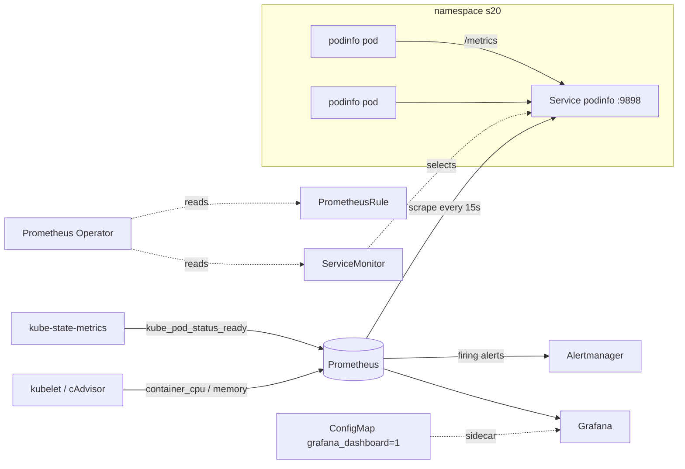
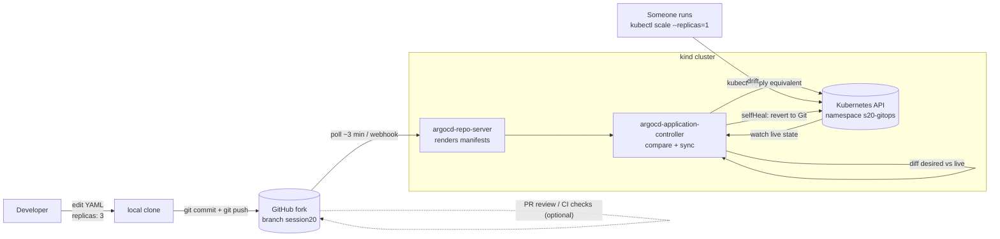
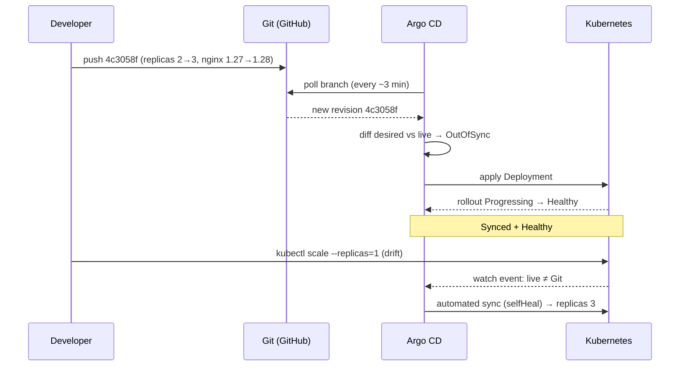

# Session 20 - Monitoring, Observability & GitOps

**Student:** Rohan Singh
**Enrollment No.:** 24BCS10240
**Session:** Session 20 - Monitoring, Observability & GitOps (Prometheus, Grafana, Argo CD)

## Task checklist

- [x] **Task 1 - Monitoring demo**: app exposing Prometheus metrics (podinfo) in namespace `s20`, ServiceMonitor, PromQL queries for CPU, memory, `up` and app metrics through the Prometheus HTTP API, logs, PrometheusRule alerts made to fire (pod not ready and app down) and seen in Prometheus and Alertmanager, health via probes + `kube_pod_status_ready`, Grafana health, dashboards listed through the API, and a dashboard provisioned from a ConfigMap
- [x] **Task 2 - Observability docs**: monitoring vs observability, metrics/logs/traces, why observability, tools, Kubernetes observability
- [x] **Task 3 - GitOps demo with Argo CD**: Git (this fork + branch) is the source of truth. Application with automated sync + prune + selfHeal into `s20-gitops`. Initial sync, a Git commit (replicas 2 to 3 and an image bump) reconciled automatically, and manual drift (`kubectl scale`) reverted by self-heal
- [x] GitOps concepts: declarative config, continuous reconciliation, workflow diagram (mermaid), Kubernetes + GitOps
- [x] Mini-project (`08-mini-project`) requirements: Namespace + Deployment (`replicas: 2`) + Service + Argo CD Application kept **outside** the watched `app/` path, change to 3 replicas through Git, self-heal demo, observe logs/pods/application, viva answers

Every command output below was captured from a real run on 2026-10-06 (times are UTC unless shown otherwise).

---

## Folder layout

```text
Rohan-24BCS10240/
├── README.md
├── monitoring/                    # Task 1 (applied with kubectl apply -f monitoring/)
│   ├── 01-app.yaml                # Namespace s20 + podinfo Deployment (probes) + Service
│   ├── 02-servicemonitor.yaml     # scrape config for the Prometheus Operator
│   ├── 03-prometheusrule.yaml     # PodinfoDown / PodinfoPodNotReady / PodinfoHighCPU
│   └── 04-grafana-dashboard.yaml  # dashboard-as-code (ConfigMap label grafana_dashboard=1)
├── gitops/                        # Task 3
│   ├── argocd-application.yaml    # applied ONCE by hand, outside the watched path
│   └── app/                       # <- Argo CD watches ONLY this folder
│       ├── namespace.yaml
│       ├── deployment.yaml
│       └── service.yaml
├── scripts/
│   ├── q.sh                       # helper: run one PromQL query through the HTTP API
│   └── queries.sh                 # runs every Task 1 query
└── outputs/
    └── 01-prometheus-queries.txt  # full, unedited output of scripts/queries.sh
```

## Environment

| Item | Value |
|---|---|
| Cluster | kind `kind-devops-heros` (1 control plane + 2 workers, Kubernetes v1.37) |
| Monitoring | Helm release `kps` (`prometheus-community/kube-prometheus-stack`) in namespace `monitoring` |
| GitOps | Argo CD (stable manifests) in namespace `argocd`, plus the `argocd` CLI (Homebrew), used with `--core` |
| Grafana | 13.2.3 |
| App | `ghcr.io/stefanprodan/podinfo:6.7.1` (exposes `/metrics`, `/healthz`, `/readyz`) |

### Platform install (shared, cluster-wide)

```bash
helm repo add prometheus-community https://prometheus-community.github.io/helm-charts
helm upgrade --install kps prometheus-community/kube-prometheus-stack -n monitoring --create-namespace \
  --set grafana.adminPassword=admin123 \
  --set prometheus.prometheusSpec.serviceMonitorSelectorNilUsesHelmValues=false \
  --set prometheus.prometheusSpec.podMonitorSelectorNilUsesHelmValues=false \
  --set prometheus.prometheusSpec.ruleSelectorNilUsesHelmValues=false \
  --wait --timeout 10m

kubectl create namespace argocd
kubectl apply -n argocd --server-side -f https://raw.githubusercontent.com/argoproj/argo-cd/stable/manifests/install.yaml
```

The three `*SelectorNilUsesHelmValues=false` flags matter. Without them, Prometheus only picks up ServiceMonitors and rules that carry the `release: kps` label. With them, it picks up every ServiceMonitor and PrometheusRule in the cluster, including the ones in my `s20` namespace.

```text
$ kubectl -n monitoring get pods
NAME                                                    READY   STATUS    RESTARTS   AGE
alertmanager-kps-kube-prometheus-stack-alertmanager-0   2/2     Running   0          5m37s
kps-grafana-5d65bffb7f-9vvcg                            3/3     Running   0          6m25s
kps-kube-prometheus-stack-operator-57cbd8fcdd-qhwph     1/1     Running   0          6m25s
kps-kube-state-metrics-747b7b996-g92xn                  1/1     Running   0          6m25s
kps-prometheus-node-exporter-8sqwk                      1/1     Running   0          6m25s
kps-prometheus-node-exporter-bq45s                      1/1     Running   0          6m25s
kps-prometheus-node-exporter-qlkcq                      1/1     Running   0          6m25s
prometheus-kps-kube-prometheus-stack-prometheus-0       2/2     Running   0          5m37s

$ kubectl -n argocd get pods
NAME                                                READY   STATUS    RESTARTS   AGE
argocd-application-controller-0                     1/1     Running   0          3m12s
argocd-applicationset-controller-7fb7c76f76-p978b   1/1     Running   0          3m12s
argocd-dex-server-7d54f7f9d6-cpjd4                  1/1     Running   0          3m12s
argocd-notifications-controller-7fcfd67447-h798k    1/1     Running   0          3m12s
argocd-redis-6bf744486c-lwzb8                       1/1     Running   0          3m12s
argocd-repo-server-57b98df6c6-kww8s                 1/1     Running   0          3m12s
argocd-server-665b8b6947-t7jx5                      1/1     Running   0          3m12s
```

---

# Task 1 - Monitoring demo



## 1.1 Deploy the app, ServiceMonitor, rules and dashboard

```text
$ kubectl apply -f monitoring/
namespace/s20 created
deployment.apps/podinfo created
service/podinfo created
servicemonitor.monitoring.coreos.com/podinfo created
prometheusrule.monitoring.coreos.com/podinfo-alerts created
configmap/s20-podinfo-dashboard created

$ kubectl -n s20 rollout status deploy/podinfo --timeout=180s
Waiting for deployment "podinfo" rollout to finish: 0 of 2 updated replicas are available...
Waiting for deployment "podinfo" rollout to finish: 1 of 2 updated replicas are available...
deployment "podinfo" successfully rolled out

$ kubectl -n s20 get deploy,pods,svc,servicemonitor,prometheusrule -o wide
NAME                      READY   UP-TO-DATE   AVAILABLE   AGE   CONTAINERS   IMAGES                               SELECTOR
deployment.apps/podinfo   2/2     2            2           29s   podinfo      ghcr.io/stefanprodan/podinfo:6.7.1   app=podinfo

NAME                           READY   STATUS    RESTARTS   AGE   IP            NODE                   NOMINATED NODE   READINESS GATES
pod/podinfo-6f5c9799d8-64hjb   1/1     Running   0          29s   10.244.2.16   devops-heros-worker    <none>           <none>
pod/podinfo-6f5c9799d8-mf6hp   1/1     Running   0          29s   10.244.1.28   devops-heros-worker2   <none>           <none>

NAME              TYPE        CLUSTER-IP   EXTERNAL-IP   PORT(S)    AGE   SELECTOR
service/podinfo   ClusterIP   10.96.3.50   <none>        9898/TCP   29s   app=podinfo

NAME                                           AGE
servicemonitor.monitoring.coreos.com/podinfo   29s

NAME                                                  AGE
prometheusrule.monitoring.coreos.com/podinfo-alerts   29s
```

Port-forwards used for the rest of the demo (local ports chosen to avoid clashes with other labs):

```bash
kubectl -n monitoring port-forward svc/kps-kube-prometheus-stack-prometheus   19090:9090
kubectl -n monitoring port-forward svc/kps-grafana                            13000:80
kubectl -n monitoring port-forward svc/kps-kube-prometheus-stack-alertmanager 19093:9093
kubectl -n s20        port-forward svc/podinfo                                19898:9898
```

```text
$ curl -s localhost:19090/-/ready
Prometheus Server is Ready.
$ curl -s localhost:19093/-/ready
OK
```

## 1.2 The app's own `/metrics` endpoint

I sent some traffic first: 60 × `GET /` and 60 × `GET /status/500`, the podinfo endpoint that returns a 500 on purpose.

```text
$ curl -s localhost:19898/metrics | grep -E '^http_request_duration_seconds_count|^http_requests_total|^process_resident'
http_request_duration_seconds_count{method="GET",path="healthz",status="200"} 2
http_request_duration_seconds_count{method="GET",path="metrics",status="200"} 1
http_request_duration_seconds_count{method="GET",path="readyz",status="200"} 5
http_request_duration_seconds_count{method="GET",path="root",status="200"} 61
http_request_duration_seconds_count{method="GET",path="status",status="500"} 60
http_requests_total{status="200"} 69
http_requests_total{status="500"} 60
process_resident_memory_bytes 4.0648704e+07
```

## 1.3 Querying Prometheus through its HTTP API

`scripts/q.sh` wraps `curl .../api/v1/query --data-urlencode 'query=...'` and uses `jq` to keep only the useful labels (`__name__, namespace, pod, container, job, status, condition, alertname, alertstate`) and the value. The complete, unedited run is in [`outputs/01-prometheus-queries.txt`](outputs/01-prometheus-queries.txt). These are the main results:

**Scrape targets: the ServiceMonitor works.** Both pods are discovered and `up`:

```text
$ curl -s "http://localhost:19090/api/v1/targets?state=active" | jq -r <s20 targets: job pod scrapeUrl health>
podinfo	podinfo-6f5c9799d8-mf6hp	http://10.244.1.28:9898/metrics	up
podinfo	podinfo-6f5c9799d8-64hjb	http://10.244.2.16:9898/metrics	up

$ curl -s http://localhost:19090/api/v1/query --data-urlencode 'query=up{namespace="s20"}' | jq -c '<keep key labels + value>'
{"__name__":"up","container":"podinfo","job":"podinfo","namespace":"s20","pod":"podinfo-6f5c9799d8-64hjb","value":"1"}
{"__name__":"up","container":"podinfo","job":"podinfo","namespace":"s20","pod":"podinfo-6f5c9799d8-mf6hp","value":"1"}
```

**CPU** (cAdvisor, via the kubelet). The value is in cores, so `0.0005` means 0.5 millicores:

```text
$ curl -s http://localhost:19090/api/v1/query --data-urlencode 'query=rate(container_cpu_usage_seconds_total{namespace="s20"}[5m])' | jq -c '<keep key labels + value>'
{"job":"kubelet","namespace":"s20","pod":"podinfo-6f5c9799d8-64hjb","value":"0"}
{"job":"kubelet","namespace":"s20","pod":"podinfo-6f5c9799d8-mf6hp","value":"0"}
{"job":"kubelet","namespace":"s20","pod":"podinfo-6f5c9799d8-mf6hp","value":"0.0006083523172282046"}
{"job":"kubelet","namespace":"s20","pod":"podinfo-6f5c9799d8-64hjb","value":"0.0003027732528984444"}
{"container":"podinfo","job":"kubelet","namespace":"s20","pod":"podinfo-6f5c9799d8-mf6hp","value":"0.0005370493665209879"}
{"container":"podinfo","job":"kubelet","namespace":"s20","pod":"podinfo-6f5c9799d8-64hjb","value":"0.0002231566986970205"}
```

The rows without a `container` label are the pod-level cgroup and the pause container. Filter on `container="podinfo"` to keep only the app:

```text
$ curl -s http://localhost:19090/api/v1/query --data-urlencode 'query=sum by (pod) (rate(container_cpu_usage_seconds_total{namespace="s20", container="podinfo"}[5m]))' | jq -c '<keep key labels + value>'
{"pod":"podinfo-6f5c9799d8-mf6hp","value":"0.0005370919363368807"}
{"pod":"podinfo-6f5c9799d8-64hjb","value":"0.00022317484658372305"}
```

**Memory**, in bytes (about 28 MiB and 18.5 MiB):

```text
$ curl -s http://localhost:19090/api/v1/query --data-urlencode 'query=container_memory_working_set_bytes{namespace="s20", container="podinfo"}' | jq -c '<keep key labels + value>'
{"__name__":"container_memory_working_set_bytes","container":"podinfo","job":"kubelet","namespace":"s20","pod":"podinfo-6f5c9799d8-mf6hp","value":"29298688"}
{"__name__":"container_memory_working_set_bytes","container":"podinfo","job":"kubelet","namespace":"s20","pod":"podinfo-6f5c9799d8-64hjb","value":"19406848"}
```

**Application metrics** (request counter, request rate by status, p95 latency):

```text
$ curl -s http://localhost:19090/api/v1/query --data-urlencode 'query=http_requests_total{namespace="s20"}' | jq -c '<keep key labels + value>'
{"__name__":"http_requests_total","container":"podinfo","job":"podinfo","namespace":"s20","pod":"podinfo-6f5c9799d8-64hjb","status":"200","value":"45"}
{"__name__":"http_requests_total","container":"podinfo","job":"podinfo","namespace":"s20","pod":"podinfo-6f5c9799d8-mf6hp","status":"200","value":"207"}
{"__name__":"http_requests_total","container":"podinfo","job":"podinfo","namespace":"s20","pod":"podinfo-6f5c9799d8-mf6hp","status":"500","value":"60"}

$ curl -s http://localhost:19090/api/v1/query --data-urlencode 'query=sum by (status) (rate(http_request_duration_seconds_count{namespace="s20"}[5m]))' | jq -c '<keep key labels + value>'
{"status":"200","value":"0.6585846222222222"}
{"status":"500","value":"0"}

$ curl -s http://localhost:19090/api/v1/query --data-urlencode 'query=histogram_quantile(0.95, sum by (le) (rate(http_request_duration_seconds_bucket{namespace="s20"}[5m])))' | jq -c '<keep key labels + value>'
{"value":"0.00475"}
```

The 500s were sent before Prometheus scraped the pod for the first time, so the counter shows 60 but the 5-minute *rate* of 500s is 0. `rate()` only counts increases that happen between samples.

**Application health** (kube-state-metrics turns the probe results into metrics):

```text
$ curl -s http://localhost:19090/api/v1/query --data-urlencode 'query=kube_pod_status_ready{namespace="s20", condition="true"}' | jq -c '<keep key labels + value>'
{"__name__":"kube_pod_status_ready","condition":"true","container":"kube-state-metrics","job":"kube-state-metrics","namespace":"s20","pod":"podinfo-6f5c9799d8-64hjb","value":"1"}
{"__name__":"kube_pod_status_ready","condition":"true","container":"kube-state-metrics","job":"kube-state-metrics","namespace":"s20","pod":"podinfo-6f5c9799d8-mf6hp","value":"1"}

$ curl -s http://localhost:19090/api/v1/query --data-urlencode 'query=kube_deployment_status_replicas_available{namespace="s20"}' | jq -c '<keep key labels + value>'
{"__name__":"kube_deployment_status_replicas_available","container":"kube-state-metrics","job":"kube-state-metrics","namespace":"s20","pod":"kps-kube-state-metrics-747b7b996-g92xn","value":"2"}
```

## 1.4 Logs

```text
$ kubectl -n s20 logs deploy/podinfo --tail=8
Found 2 pods, using pod/podinfo-6f5c9799d8-mf6hp
{"level":"info","ts":"2026-10-06T11:04:20.673Z","caller":"podinfo/main.go:153","msg":"Starting podinfo","version":"6.7.1","revision":"6b7aab8a10d6ee8b895b0a5048f4ab0966ed29ff","port":"9898"}
{"level":"info","ts":"2026-10-06T11:04:20.673Z","caller":"http/server.go:224","msg":"Starting HTTP Server.","addr":":9898"}
```

Logs from every replica, using a label selector and a prefix (taken after the pods were recreated in 1.6):

```text
$ kubectl -n s20 logs -l app=podinfo --prefix --tail=3
[pod/podinfo-6f5c9799d8-sbzf9/podinfo] {"level":"info","ts":"2026-10-06T11:11:52.340Z","caller":"podinfo/main.go:153","msg":"Starting podinfo","version":"6.7.1","revision":"6b7aab8a10d6ee8b895b0a5048f4ab0966ed29ff","port":"9898"}
[pod/podinfo-6f5c9799d8-sbzf9/podinfo] {"level":"info","ts":"2026-10-06T11:11:52.340Z","caller":"http/server.go:224","msg":"Starting HTTP Server.","addr":":9898"}
[pod/podinfo-6f5c9799d8-vlzq6/podinfo] {"level":"info","ts":"2026-10-06T11:11:52.376Z","caller":"podinfo/main.go:153","msg":"Starting podinfo","version":"6.7.1","revision":"6b7aab8a10d6ee8b895b0a5048f4ab0966ed29ff","port":"9898"}
[pod/podinfo-6f5c9799d8-vlzq6/podinfo] {"level":"info","ts":"2026-10-06T11:11:52.377Z","caller":"http/server.go:224","msg":"Starting HTTP Server.","addr":":9898"}
```

podinfo writes **structured JSON logs**, so a log system such as Loki or Elasticsearch can index fields like `level` and `caller`. I did not install Loki. `kubectl logs` was enough for this lab. In production, a Promtail or Alloy DaemonSet would ship these container logs to Loki, and Grafana would show them next to the metrics.

## 1.5 Alert rules (PrometheusRule)

| Alert | Expression (simplified) | for | Severity |
|---|---|---|---|
| `PodinfoDown` | `(sum(up{namespace="s20",job="podinfo"}) or vector(0)) == 0` | 30s | critical |
| `PodinfoPodNotReady` | `sum by (pod)(kube_pod_status_ready{namespace="s20",condition="false"}) > 0` | 30s | warning |
| `PodinfoHighCPU` | `sum by (pod)(rate(container_cpu_usage_seconds_total{namespace="s20",container="podinfo"}[5m])) > 0.16` (80% of the 200m limit) | 1m | warning |

`or vector(0)` is needed for the "app down" case. When the app is scaled to 0 the targets disappear, `up` returns *no series* instead of `0`, and without the fallback the alert would never fire.

The operator loaded the rules into Prometheus:

```text
$ curl -s localhost:19090/api/v1/rules | jq -c '.data.groups[] | select(.name=="s20-podinfo.rules") | .rules[] | {alert: .name, health: .health, state: .state, query: .query}'
{"alert":"PodinfoDown","health":"ok","state":"inactive","query":"(sum(up{job=\"podinfo\",namespace=\"s20\"}) or vector(0)) == 0"}
{"alert":"PodinfoPodNotReady","health":"ok","state":"inactive","query":"sum by (pod) (kube_pod_status_ready{condition=\"false\",namespace=\"s20\"}) > 0"}
{"alert":"PodinfoHighCPU","health":"ok","state":"inactive","query":"sum by (pod) (rate(container_cpu_usage_seconds_total{container=\"podinfo\",namespace=\"s20\"}[5m])) > 0.16"}
```

## 1.6 Making the alerts fire

### Demo A: readiness failure, so `PodinfoPodNotReady` fires

podinfo has an endpoint that makes its own `/readyz` return 503. I called it on one pod through the port-forward:

```text
$ date -u +%T; curl -s -X POST localhost:19898/readyz/disable -w '%{http_code}\n'; sleep 20; kubectl -n s20 get pods
11:07:21
202
NAME                       READY   STATUS    RESTARTS   AGE
podinfo-6f5c9799d8-64hjb   1/1     Running   0          3m41s
podinfo-6f5c9799d8-mf6hp   0/1     Running   0          3m41s

$ kubectl -n s20 get events --field-selector reason=Unhealthy
LAST SEEN   TYPE      REASON      OBJECT                         MESSAGE
17s         Warning   Unhealthy   pod/podinfo-6f5c9799d8-mf6hp   Readiness probe failed: HTTP probe failed with statuscode: 503
```

The pod keeps `Running` because liveness still passes, but it is removed from the Service endpoints. The health metric shows the change:

```text
$ curl -s http://localhost:19090/api/v1/query --data-urlencode 'query=kube_pod_status_ready{namespace="s20", condition="false"}' | jq -c '<keep key labels + value>'
{"__name__":"kube_pod_status_ready","condition":"false","container":"kube-state-metrics","job":"kube-state-metrics","namespace":"s20","pod":"podinfo-6f5c9799d8-64hjb","value":"0"}
{"__name__":"kube_pod_status_ready","condition":"false","container":"kube-state-metrics","job":"kube-state-metrics","namespace":"s20","pod":"podinfo-6f5c9799d8-mf6hp","value":"1"}
```

Prometheus `/api/v1/alerts`. The alert was pending at 11:08:12 and firing 30s later:

```text
$ curl -s localhost:19090/api/v1/alerts | jq -c '.data.alerts[] | select(.labels.team=="s20") | {alertname: .labels.alertname, pod: .labels.pod, severity: .labels.severity, state, activeAt}'
{"alertname":"PodinfoPodNotReady","pod":"podinfo-6f5c9799d8-mf6hp","severity":"warning","state":"firing","activeAt":"2026-10-06T11:08:12.18654071Z"}
```

It was delivered to Alertmanager (`/api/v2/alerts`):

```text
$ curl -s 'localhost:19093/api/v2/alerts?filter=team="s20"' | jq -c '.[] | {alertname: .labels.alertname, pod: .labels.pod, severity: .labels.severity, state: .status.state, startsAt, summary: .annotations.summary}'
{"alertname":"PodinfoPodNotReady","pod":"podinfo-6f5c9799d8-mf6hp","severity":"warning","state":"active","startsAt":"2026-10-06T11:08:42.186Z","summary":"Pod podinfo-6f5c9799d8-mf6hp in s20 is not ready"}
```

The chart's built-in rules also noticed the problem and went to `pending`. These alerts keep their `namespace` label. Mine has no `namespace` label because `sum by (pod)` drops it, which is why I filter my alerts on `team="s20"`:

```text
$ curl -s http://localhost:19090/api/v1/query --data-urlencode 'query=ALERTS{namespace="s20"}' | jq -c '<keep key labels + value>'
{"__name__":"ALERTS","alertname":"KubePodNotReady","alertstate":"pending","job":"kube-state-metrics","namespace":"s20","pod":"podinfo-6f5c9799d8-mf6hp","value":"1"}
{"__name__":"ALERTS","alertname":"KubeDeploymentReplicasMismatch","alertstate":"pending","container":"kube-state-metrics","job":"kube-state-metrics","namespace":"s20","pod":"kps-kube-state-metrics-747b7b996-g92xn","value":"1"}
```

Recovery: `curl -X POST localhost:19898/readyz/enable` returned `202`, and then:

```text
$ kubectl -n s20 wait --for=condition=Ready pod -l app=podinfo --timeout=90s; kubectl -n s20 get pods
pod/podinfo-6f5c9799d8-64hjb condition met
pod/podinfo-6f5c9799d8-mf6hp condition met
NAME                       READY   STATUS    RESTARTS   AGE
podinfo-6f5c9799d8-64hjb   1/1     Running   0          6m8s
podinfo-6f5c9799d8-mf6hp   1/1     Running   0          6m8s
```

### Demo B: scale to 0, so `PodinfoDown` fires

```text
$ date -u +%T; kubectl -n s20 scale deploy/podinfo --replicas=0; kubectl -n s20 get deploy podinfo
11:10:11
deployment.apps/podinfo scaled
NAME      READY   UP-TO-DATE   AVAILABLE   AGE
podinfo   2/0     2            2           6m11s

# (waited until the alert was firing)
11:11:42
NAME                      READY   UP-TO-DATE   AVAILABLE   AGE
deployment.apps/podinfo   0/0     0            0           7m42s

$ curl -s localhost:19090/api/v1/alerts | jq -c '.data.alerts[] | select(.labels.team=="s20") | {alertname: .labels.alertname, severity: .labels.severity, state, activeAt, value}'
{"alertname":"PodinfoDown","severity":"critical","state":"firing","activeAt":"2026-10-06T11:10:42.18654071Z","value":"0e+00"}

$ curl -s 'localhost:19093/api/v2/alerts?filter=team="s20"' | jq -c '.[] | {alertname: .labels.alertname, severity: .labels.severity, state: .status.state, startsAt, summary: .annotations.summary, receivers: [.receivers[].name]}'
{"alertname":"PodinfoDown","severity":"critical","state":"active","startsAt":"2026-10-06T11:11:12.186Z","summary":"podinfo in namespace s20 is down","receivers":["null"]}
```

The receiver is `null` because the chart's default Alertmanager config does not send notifications anywhere. In a real setup I would add a Slack, email or PagerDuty receiver, routed on `severity`.

Recovery (scaled back to 2):

```text
$ date -u +%T; kubectl -n s20 scale deploy/podinfo --replicas=2; kubectl -n s20 rollout status deploy/podinfo --timeout=120s
11:11:51
deployment.apps/podinfo scaled
Waiting for deployment "podinfo" rollout to finish: 0 of 2 updated replicas are available...
Waiting for deployment "podinfo" rollout to finish: 1 of 2 updated replicas are available...
deployment "podinfo" successfully rolled out

$ curl -s 'localhost:19093/api/v2/alerts?filter=team="s20"' | jq -c '.'     # at 11:12:51
[]
$ curl -s http://localhost:19090/api/v1/query --data-urlencode 'query=up{namespace="s20"}' | jq -c '<keep key labels + value>'
{"__name__":"up","container":"podinfo","job":"podinfo","namespace":"s20","pod":"podinfo-6f5c9799d8-sbzf9","value":"1"}
{"__name__":"up","container":"podinfo","job":"podinfo","namespace":"s20","pod":"podinfo-6f5c9799d8-vlzq6","value":"1"}
```

At 11:12:51, Prometheus still listed `PodinfoPodNotReady` as **pending** for the 2 new pods, which were not ready yet when kube-state-metrics last updated. Pending alerts are not sent to Alertmanager, which is why its list above is empty. A few minutes later the count was 0:

```text
$ curl -s localhost:19090/api/v1/alerts | jq -c '[.data.alerts[] | select(.labels.team=="s20")] | length'
0
```

This shows why alerts use `for:`: it stops short, self-healing blips from paging someone. `PodinfoHighCPU` was **not** made to fire. The app idles at under 1 millicore, and I did not run a CPU stress test.

## 1.7 Application health (probes)

`monitoring/01-app.yaml` defines both probes:

| Probe | Endpoint | Effect when failing |
|---|---|---|
| `livenessProbe` | `GET /healthz` | kubelet **restarts** the container |
| `readinessProbe` | `GET /readyz` | pod is **removed from Service endpoints**, no restart |

Demo A showed the readiness path end to end: probe returns 503, then the event `Readiness probe failed`, then `READY 0/1`, then `kube_pod_status_ready{condition="false"} = 1`, then the alert, then Alertmanager.

## 1.8 Grafana

Health check and datasources:

```text
$ curl -s localhost:13000/api/health
{
  "database": "ok",
  "version": "13.2.3",
  "commit": "90ffed056f0884267356c12a0eeb72a022af53f1"
}

$ curl -s -u admin:admin123 localhost:13000/api/datasources | jq -c '.[] | {uid,name,type,url,isDefault}'
{"uid":"alertmanager","name":"Alertmanager","type":"alertmanager","url":"http://kps-kube-prometheus-stack-alertmanager.monitoring:9093/","isDefault":false}
{"uid":"prometheus","name":"Prometheus","type":"prometheus","url":"http://kps-kube-prometheus-stack-prometheus.monitoring:9090/","isDefault":true}
```

Dashboards listed through the search API. The chart ships the Kubernetes mixin dashboards, and the last row is **mine**, provisioned from `monitoring/04-grafana-dashboard.yaml`:

```text
$ curl -s -u admin:admin123 'localhost:13000/api/search?type=dash-db' | jq -r '.[] | [.uid, .title] | @tsv'
alertmanager-overview	Alertmanager / Overview
vkQ0UHxik	CoreDNS
c2f4e12cdf69feb95caa41a5a1b423d9	etcd
6be0s85Mk	Grafana Overview
09ec8aa1e996d6ffcd6817bbaff4db1b	Kubernetes / API server
b59e6c9f2fcbe2e16d77fc492374cc4f	Kubernetes / Compute Resources /  Multi-Cluster
efa86fd1d0c121a26444b636a3f509a8	Kubernetes / Compute Resources / Cluster
85a562078cdf77779eaa1add43ccec1e	Kubernetes / Compute Resources / Namespace (Pods)
a87fb0d919ec0ea5f6543124e16c42a5	Kubernetes / Compute Resources / Namespace (Workloads)
200ac8fdbfbb74b39aff88118e4d1c2c	Kubernetes / Compute Resources / Node (Pods)
058020e04168bfdea0c52269cb699df2	Kubernetes / Compute Resources / Nodes Overview
6581e46e4e5c7ba40a07646395ef7b23	Kubernetes / Compute Resources / Pod
a164a7f0339f99e89cea5cb47e9be617	Kubernetes / Compute Resources / Workload
72e0e05bef5099e5f049b05fdc429ed4	Kubernetes / Controller Manager
3138fa155d5915769fbded898ac09fd9	Kubernetes / Kubelet
ff635a025bcfea7bc3dd4f508990a3e9	Kubernetes / Networking / Cluster
8b7a8b326d7a6f1f04244066368c67af	Kubernetes / Networking / Namespace (Pods)
bbb2a765a623ae38130206c7d94a160f	Kubernetes / Networking / Namespace (Workload)
7a18067ce943a40ae25454675c19ff5c	Kubernetes / Networking / Pod
728bf77cc1166d2f3133bf25846876cc	Kubernetes / Networking / Workload
919b92a8e8041bd567af9edab12c840c	Kubernetes / Persistent Volumes
632e265de029684c40b21cb76bca4f94	Kubernetes / Proxy
2e6b6a3b4bddf1427b3a55aa1311c656	Kubernetes / Scheduler
7e0a61e486f727d763fb1d86fdd629c2	Node Exporter / AIX
629701ea43bf69291922ea45f4a87d37	Node Exporter / MacOS
7d57716318ee0dddbac5a7f451fb7753	Node Exporter / Nodes
3e97d1d02672cdd0861f4c97c64f89b2	Node Exporter / USE Method / Cluster
fac67cfbe174d3ef53eb473d73d9212f	Node Exporter / USE Method / Node
9fa0d141-d019-4ad7-8bc5-42196ee308bd	Prometheus / Overview
s20-podinfo	S20 - podinfo (24BCS10240)

$ curl -s -u admin:admin123 'localhost:13000/api/search?query=S20' | jq -c '.[] | {uid,title,url,tags}'
{"uid":"s20-podinfo","title":"S20 - podinfo (24BCS10240)","url":"/d/s20-podinfo/s20-podinfo-24bcs10240","tags":["s20","session20"]}

$ curl -s -u admin:admin123 localhost:13000/api/dashboards/uid/s20-podinfo | jq -c '{title: .dashboard.title, panels: [.dashboard.panels[].title], provisioned: .meta.provisioned, folder: .meta.folderTitle}'
{"title":"S20 - podinfo (24BCS10240)","panels":["CPU (cores) per pod","Memory working set (bytes) per pod","HTTP requests/s (app metric)","Targets up"],"provisioned":true,"folder":"General"}
```

Grafana can reach Prometheus. This is one of the dashboard's panel queries, sent through Grafana's datasource proxy:

```text
$ curl -s -u admin:admin123 'localhost:13000/api/datasources/proxy/uid/prometheus/api/v1/query' --data-urlencode 'query=sum(up{namespace="s20", job="podinfo"})' | jq -c '.data.result'
[{"metric":{},"value":[1791285507.141,"2"]}]
```

The dashboard is provisioned as code. A Grafana sidecar container watches for ConfigMaps labelled `grafana_dashboard: "1"` and loads their JSON, so the dashboard is version-controlled like everything else. UI: `http://localhost:13000/d/s20-podinfo` (login `admin` / `admin123`).

---

# Task 2 - Observability concepts

## Monitoring vs observability

| | Monitoring | Observability |
|---|---|---|
| Question | "**Is** something wrong?" | "**Why** is it wrong?" |
| Problems | Known failure modes you predicted ("known unknowns") | New, unexpected failures ("unknown unknowns") |
| Shape | Predefined dashboards + threshold alerts | Rich, high-cardinality telemetry you can slice and correlate freely |
| Example from this lab | `PodinfoDown` fires when `up == 0` | Following a 500 from the request counter to the pod, its logs and the trace of the slow call |
| Relationship | A *subset* of observability, the part you automate | A *property* of the system: how well its internal state can be understood from its outputs |

Monitoring tells you the website is slow. Observability tells you it is slow because one database query in the payment service takes 1.2 s for one customer segment.

## Why observability matters

- **Distributed systems fail in new ways.** One user request can touch 10+ services. When it fails, you need to know which hop failed, not just that the API returned 500.
- **Lower MTTD and MTTR** (mean time to detect / to recover): alerts detect problems, and correlated telemetry shortens the investigation.
- **SLOs and error budgets**: you can only promise "99.9% of requests under 300 ms" if you measure it.
- **Capacity and cost**: CPU and memory metrics feed requests/limits, HPA and right-sizing.
- **Safe delivery**: canary analysis and GitOps rollbacks depend on metrics to decide whether a release is healthy.
- **Ephemeral infrastructure**: pods are recreated constantly. If telemetry is not collected centrally, it is lost with the pod.

## The three pillars

| Pillar | What it is | Answers | Example from this lab | Typical tools |
|---|---|---|---|---|
| **Metrics** | Numeric time series (counter, gauge, histogram) with labels. Cheap to store and fast to aggregate | "How much / how often / how fast?" | `http_requests_total`, `container_memory_working_set_bytes`, p95 from `http_request_duration_seconds_bucket` | Prometheus, Thanos/Mimir, Datadog, CloudWatch |
| **Logs** | Timestamped event records, ideally structured (JSON) | "What exactly happened?" | podinfo JSON log `"msg":"Starting HTTP Server."`, nginx access logs of probe calls | Loki, ELK/EFK (Elasticsearch + Logstash/Fluentd + Kibana), Splunk |
| **Traces** | The path of one request across services as a tree of *spans* sharing a trace ID | "Where did the time go / which hop failed?" | Not collected here. podinfo supports OpenTelemetry tracing, but no tracing backend was installed | Jaeger, Grafana Tempo, Zipkin, AWS X-Ray |

They work best when **correlated**: an alert (metric) leads to the logs for that pod and time window, and a trace ID in a log line opens the trace of the slow request. Exemplars, `trace_id` fields in logs and shared labels such as `namespace` and `pod` make that possible. Profiling (continuous CPU/memory profiles, e.g. Pyroscope) and events are often called the 4th and 5th signals.

## Common tools

| Tool | Category | Notes |
|---|---|---|
| **Prometheus** | Metrics (pull model) + PromQL + alert rules | CNCF graduated, the default for Kubernetes. Used here |
| **Alertmanager** | Alert routing | Grouping, silencing, inhibition, receivers (Slack, PagerDuty...). Used here |
| **Grafana** | Visualisation | Dashboards over many datasources (Prometheus, Loki, Tempo, Elasticsearch...). Used here |
| **kube-state-metrics / node-exporter / cAdvisor** | Exporters | Kubernetes object state, node OS metrics, container resource metrics. All used here |
| **Loki** | Logs | Indexes only labels, not the full text, so it is cheap. Queried with LogQL |
| **ELK / EFK** | Logs | Elasticsearch + Logstash/Fluentd/Fluent Bit + Kibana. Full-text search |
| **Jaeger / Tempo / Zipkin** | Traces | Tempo stores traces in object storage and pairs with Grafana |
| **OpenTelemetry** | Instrumentation standard | Vendor-neutral SDKs + Collector for metrics, logs and traces (OTLP). Instrument once, send anywhere |
| **Thanos / Cortex / Mimir** | Long-term, HA Prometheus storage | Global view across clusters |
| **Datadog, New Relic, Dynatrace, Splunk, Honeycomb** | SaaS / commercial | All-in-one, paid per host or data volume |
| **Cloud-native** | Managed | AWS CloudWatch + X-Ray, Google Cloud Operations, Azure Monitor |

## Observability in Kubernetes

What is different in Kubernetes:

- **Everything is ephemeral and dynamic.** Pod IPs change, so Prometheus uses **service discovery** (ServiceMonitor/PodMonitor through the Prometheus Operator) instead of static targets. In this lab, the new pods `sbzf9`/`vlzq6` were scraped automatically after the scale-to-0.
- **Signals come from several layers:**
  - Node: node-exporter (CPU, disk, network of the machine)
  - Container: cAdvisor in the kubelet (`container_cpu_usage_seconds_total`, `container_memory_working_set_bytes`)
  - Kubernetes objects: kube-state-metrics (`kube_pod_status_ready`, `kube_deployment_status_replicas_available`)
  - Control plane: API server, scheduler, etcd, CoreDNS metrics (the chart's dashboards above)
  - Application: the app's own `/metrics` (`http_requests_total`)
  - Events: `kubectl get events` (e.g. `Readiness probe failed`)
- **Health is built in**: liveness, readiness and startup probes, plus `kubectl top` through metrics-server, which feeds HPA.
- **Logs**: containers log to stdout/stderr. The kubelet keeps them on the node (`kubectl logs`). A DaemonSet agent (Promtail/Alloy, Fluent Bit) ships them to Loki or Elasticsearch, because the logs are gone once the pod is deleted.
- **Everything as code**: ServiceMonitor, PrometheusRule and dashboard ConfigMaps are Kubernetes objects, so they can be stored in Git and deployed with GitOps (Task 3) like the app itself.
- **Labels are the glue**: `namespace`, `pod` and `container` labels are the same across metrics, logs and traces, and that is what lets you correlate them.

---

# Task 3 - GitOps with Argo CD

## What GitOps is

GitOps is a way of running infrastructure and applications where **Git is the single source of truth for the desired state**, and an **automated agent inside the cluster continuously makes the actual state match it**. The OpenGitOps principles:

1. **Declarative**: the whole system is described as desired state (YAML), not as a sequence of commands.
2. **Versioned and immutable**: that state lives in Git, so every change is a commit with author, review (PR) and history, and can be reverted.
3. **Pulled automatically**: an agent (Argo CD, Flux) *pulls* from Git. CI does not push into the cluster, so no cluster credentials are stored in CI.
4. **Continuously reconciled**: the agent keeps comparing desired and actual state and corrects any difference (drift), not only when something is deployed.

### Declarative configuration

Imperative: `kubectl scale deploy x --replicas=3`, then `kubectl set image ...`. This is a list of steps, the result depends on the starting point, and nothing records it.
Declarative: `replicas: 3` and `image: nginx:1.28-alpine` in `deployment.yaml`. You describe the *end result*, and the controller works out the steps. Applying it is idempotent, so applying it twice changes nothing.

### Continuous reconciliation

Kubernetes controllers already work in a loop: *observe, diff, act*. A Deployment controller keeps the pod count equal to `spec.replicas`. Argo CD adds **one more loop above that**, where the desired state is the Git commit rather than whatever was last `kubectl apply`-ed. Argo CD polls Git every ~3 minutes, or immediately on a webhook, and also watches the live cluster objects. With `selfHeal: true`, any live change that differs from Git is reverted.

| Term | Meaning in this demo |
|---|---|
| Desired state | `gitops/app/*.yaml` at the tip of branch `session20` |
| Actual (live) state | The objects in namespace `s20-gitops` |
| Sync status | `Synced` if live == Git, `OutOfSync` otherwise |
| Health status | `Healthy` / `Progressing` / `Degraded`, based on the resource type (e.g. Deployment rollout complete) |
| Reconciliation | Argo CD applying the diff so that live == Git |
| Prune | Deleting live objects whose YAML was removed from Git |
| Self-heal | Re-syncing when the *cluster* changes, not only when Git changes |

### GitOps workflow





### Kubernetes + GitOps

- Kubernetes is already **declarative and API-driven**, so Git can hold the full desired state: Deployments, Services, ConfigMaps, RBAC, CRDs, and even the monitoring objects from Task 1.
- Argo CD itself is a Kubernetes controller. Its configuration is a CRD (`Application`), so it can also be managed by GitOps ("app of apps").
- **Benefits**: an audit trail (`git log` shows who changed what in production), easy rollback (`git revert`), PR-based change review, disaster recovery (point a new cluster at the repo), no `kubectl` access needed for developers, drift detection, and one repeatable workflow for many clusters and environments.
- **Repo layout tip**: keep application code and deployment config apart (often in separate repos). CI builds and pushes the image, then commits the new tag to the config repo, and Argo CD deploys it.
- **Secrets** should not be stored in Git in plain text. Use Sealed Secrets, SOPS or External Secrets Operator.

## 3.1 The manifests

`gitops/app/` holds the workload, which is the only path Argo CD renders: `namespace.yaml` (`s20-gitops`), `deployment.yaml` (`s20-gitops-app`, nginx, **replicas: 2** at the start) and `service.yaml`.
`gitops/argocd-application.yaml` is **outside** that path, as the mini-project spec asks. It is the pointer that tells Argo CD what to watch:

```yaml
spec:
  source:
    repoURL: https://github.com/RohanSingh0208/devops-heros.git
    targetRevision: session20
    path: session20-monitoring-observability-gitops/Rohan-24BCS10240/gitops/app
  destination:
    server: https://kubernetes.default.svc
    namespace: s20-gitops
  syncPolicy:
    automated: { prune: true, selfHeal: true }
    syncOptions: [ CreateNamespace=true ]
```

## 3.2 Initial sync

The manifests were first committed as `1a56b01` and pushed to `origin` (the fork). Then I applied the Application once:

```text
$ git push -u origin session20
To https://github.com/RohanSingh0208/devops-heros.git
 * [new branch]      session20 -> session20
branch 'session20' set up to track 'origin/session20'.

$ kubectl apply -f gitops/argocd-application.yaml
application.argoproj.io/s20-gitops-24bcs10240 created

$ kubectl get application -n argocd s20-gitops-24bcs10240        # at 11:14:09
NAME                    SYNC STATUS   HEALTH STATUS
s20-gitops-24bcs10240   Synced        Healthy

$ kubectl -n s20-gitops get deploy,pods,svc
NAME                             READY   UP-TO-DATE   AVAILABLE   AGE
deployment.apps/s20-gitops-app   2/2     2            2           67s

NAME                                  READY   STATUS    RESTARTS   AGE
pod/s20-gitops-app-675b5b8764-mc642   1/1     Running   0          67s
pod/s20-gitops-app-675b5b8764-mvvl9   1/1     Running   0          67s

NAME                     TYPE        CLUSTER-IP    EXTERNAL-IP   PORT(S)   AGE
service/s20-gitops-app   ClusterIP   10.96.36.59   <none>        80/TCP    67s
```

I never ran `kubectl apply` on `deployment.yaml` or `service.yaml`. Argo CD created the namespace and both objects from Git. The synced revision is exactly my commit:

```text
$ kubectl -n argocd get application s20-gitops-24bcs10240 -o jsonpath='{.status.sync.revision}{"\n"}'; git rev-parse HEAD
1a56b019d848901c56f7e90656c7add45c290f34
1a56b019d848901c56f7e90656c7add45c290f34

$ argocd app get s20-gitops-24bcs10240 --core
Name:               argocd/s20-gitops-24bcs10240
Project:            default
Server:             https://kubernetes.default.svc
Namespace:          s20-gitops
URL:                http://localhost:55026/applications/s20-gitops-24bcs10240
Source:
- Repo:             https://github.com/RohanSingh0208/devops-heros.git
  Target:           session20
  Path:             session20-monitoring-observability-gitops/Rohan-24BCS10240/gitops/app
SyncWindow:         Sync Allowed
Sync Policy:        Automated (Prune)
Sync Status:        Synced to session20 (1a56b01)
Health Status:      Healthy

GROUP  KIND        NAMESPACE   NAME            STATUS  HEALTH   HOOK  MESSAGE
apps   Deployment  s20-gitops  s20-gitops-app  Synced  Healthy        deployment.apps/s20-gitops-app unchanged
       Namespace               s20-gitops      Synced                 
       Service     s20-gitops  s20-gitops-app  Synced  Healthy        
```

(`argocd --core` talks to the Kubernetes API directly with my kubeconfig, so no `argocd login` or port-forward to argocd-server is needed.)

## 3.3 Change the desired state in Git, and Argo CD reconciles

**Before:**

```text
$ kubectl -n s20-gitops get deploy s20-gitops-app -o wide
NAME             READY   UP-TO-DATE   AVAILABLE   AGE   CONTAINERS   IMAGES              SELECTOR
s20-gitops-app   2/2     2            2           84s   app          nginx:1.27-alpine   app=s20-gitops-app
```

**The Git change.** Only Git is edited, with no `kubectl`:

```diff
$ git diff
--- a/session20-monitoring-observability-gitops/Rohan-24BCS10240/gitops/app/deployment.yaml
+++ b/session20-monitoring-observability-gitops/Rohan-24BCS10240/gitops/app/deployment.yaml
@@ -6,7 +6,7 @@ metadata:
   labels:
     app: s20-gitops-app
 spec:
-  replicas: 2
+  replicas: 3
   selector:
     matchLabels:
       app: s20-gitops-app
@@ -17,7 +17,7 @@ spec:
     spec:
       containers:
         - name: app
-          image: nginx:1.27-alpine
+          image: nginx:1.28-alpine
           ports:
             - containerPort: 80
           resources:
```

```text
$ git commit -am "session20(24BCS10240): GitOps scale to 3 replicas and bump nginx to 1.28-alpine"
$ git push origin session20
$ git log --oneline -3
4c3058f session20(24BCS10240): GitOps scale to 3 replicas and bump nginx to 1.28-alpine
1a56b01 session20(24BCS10240): monitoring manifests and GitOps app (replicas: 2)
8376590 replicas from 2 to 5
```

**Argo CD picks it up on its normal poll.** I did not run a manual refresh or sync. The push finished at about 11:14:54 UTC, and Argo CD synced the new revision at 11:17:12 UTC, within the default ~3-minute polling interval:

```text
$ until kubectl -n argocd get application s20-gitops-24bcs10240 -o jsonpath='{.status.sync.revision}' | grep -q '^4c3058f'; do sleep 5; done
# started 11:14:54, matched 11:17:15
$ kubectl -n s20-gitops rollout status deploy/s20-gitops-app --timeout=180s
Waiting for deployment "s20-gitops-app" rollout to finish: 1 out of 3 new replicas have been updated...
Waiting for deployment "s20-gitops-app" rollout to finish: 2 out of 3 new replicas have been updated...
Waiting for deployment "s20-gitops-app" rollout to finish: 1 old replicas are pending termination...
deployment "s20-gitops-app" successfully rolled out
```

(Repeated identical "Waiting..." lines are collapsed above.)

**After:**

```text
$ kubectl get application -n argocd s20-gitops-24bcs10240
NAME                    SYNC STATUS   HEALTH STATUS
s20-gitops-24bcs10240   Synced        Healthy

$ kubectl -n s20-gitops get deploy s20-gitops-app -o wide
NAME             READY   UP-TO-DATE   AVAILABLE   AGE     CONTAINERS   IMAGES              SELECTOR
s20-gitops-app   3/3     3            3           4m43s   app          nginx:1.28-alpine   app=s20-gitops-app

$ kubectl -n s20-gitops get pods
NAME                              READY   STATUS    RESTARTS   AGE
s20-gitops-app-5f6bf5f7bf-q7skl   1/1     Running   0          9s
s20-gitops-app-5f6bf5f7bf-qmrf8   1/1     Running   0          23s
s20-gitops-app-5f6bf5f7bf-vqptt   1/1     Running   0          41s

$ argocd app history s20-gitops-24bcs10240 --core
SOURCE  https://github.com/RohanSingh0208/devops-heros.git
ID      DATE                            REVISION
0       2026-10-06 19:13:02 +0800 WITA  session20 (1a56b01)
1       2026-10-06 19:17:12 +0800 WITA  session20 (4c3058f)
```

The pod count went from 2 to 3. The new pods come from a new ReplicaSet hash (`675b5b8764` changed to `5f6bf5f7bf`) because the pod template changed (new image), so this was a rolling update. Argo CD's history (shown in local time, UTC+8) has one entry per Git revision. Rolling back means deploying an older revision, ideally with `git revert`.

## 3.4 Drift and self-heal

Someone changes production by hand:

```text
$ date -u +%T; kubectl -n s20-gitops scale deploy/s20-gitops-app --replicas=1; kubectl -n s20-gitops get deploy s20-gitops-app; sleep 2; date -u +%T; kubectl -n s20-gitops get deploy s20-gitops-app; kubectl get application -n argocd s20-gitops-24bcs10240
11:17:58
deployment.apps/s20-gitops-app scaled
NAME             READY   UP-TO-DATE   AVAILABLE   AGE
s20-gitops-app   3/1     3            3           4m56s
11:18:00
NAME             READY   UP-TO-DATE   AVAILABLE   AGE
s20-gitops-app   3/3     3            3           4m58s
NAME                    SYNC STATUS   HEALTH STATUS
s20-gitops-24bcs10240   Synced        Healthy
```

`3/1` means the desired count was set to 1 while 3 pods still existed. Less than 2 seconds later the desired count was back to 3. Argo CD's records show it was an **automated** sync:

```text
$ kubectl -n argocd get application s20-gitops-24bcs10240 -o json | jq '{operationState: {phase: .status.operationState.phase, message: .status.operationState.message, startedAt: .status.operationState.startedAt, finishedAt: .status.operationState.finishedAt, initiatedBy: .status.operationState.operation.initiatedBy, revision: .status.operationState.syncResult.revision}}'
{
  "operationState": {
    "phase": "Succeeded",
    "message": "successfully synced (all tasks run)",
    "startedAt": "2026-10-06T11:17:58Z",
    "finishedAt": "2026-10-06T11:17:59Z",
    "initiatedBy": {
      "automated": true
    },
    "revision": "4c3058f384d7f60ac8b982aae968f91388919be4"
  }
}

$ kubectl -n argocd get events --field-selector involvedObject.name=s20-gitops-24bcs10240 --sort-by=.lastTimestamp | tail -8
57s         Normal   OperationCompleted   application/s20-gitops-24bcs10240   Partial sync operation to 4c3058f384d7f60ac8b982aae968f91388919be4 succeeded
24s         Normal   ResourceUpdated      application/s20-gitops-24bcs10240   Updated health status: Progressing -> Healthy
11s         Normal   OperationStarted     application/s20-gitops-24bcs10240   Initiated automated sync to '4c3058f384d7f60ac8b982aae968f91388919be4'
11s         Normal   ResourceUpdated      application/s20-gitops-24bcs10240   Updated sync status: Synced -> OutOfSync
10s         Normal   OperationCompleted   application/s20-gitops-24bcs10240   Partial sync operation to 4c3058f384d7f60ac8b982aae968f91388919be4 succeeded
10s         Normal   ResourceUpdated      application/s20-gitops-24bcs10240   Updated sync status: OutOfSync -> Synced
10s         Normal   ResourceUpdated      application/s20-gitops-24bcs10240   Updated health status: Healthy -> Progressing
9s          Normal   ResourceUpdated      application/s20-gitops-24bcs10240   Updated health status: Progressing -> Healthy

$ kubectl -n s20-gitops get events --field-selector involvedObject.kind=Deployment --sort-by=.lastTimestamp | tail -6
39s         Normal   ScalingReplicaSet   deployment/s20-gitops-app   Scaled up replica set s20-gitops-app-5f6bf5f7bf from 1 to 2
25s         Normal   ScalingReplicaSet   deployment/s20-gitops-app   Scaled down replica set s20-gitops-app-675b5b8764 from 2 to 1
25s         Normal   ScalingReplicaSet   deployment/s20-gitops-app   Scaled up replica set s20-gitops-app-5f6bf5f7bf from 2 to 3
24s         Normal   ScalingReplicaSet   deployment/s20-gitops-app   Scaled down replica set s20-gitops-app-675b5b8764 from 1 to 0
11s         Normal   ScalingReplicaSet   deployment/s20-gitops-app   Scaled down replica set s20-gitops-app-5f6bf5f7bf from 3 to 1
10s         Normal   ScalingReplicaSet   deployment/s20-gitops-app   (combined from similar events): Scaled up replica set s20-gitops-app-5f6bf5f7bf from 1 to 3
```

The events show both stories. The older lines are the rolling update from the Git commit (old RS `675b5b8764` scaled down, new RS `5f6bf5f7bf` scaled up). The last two lines are the drift (3 to 1) and the self-heal (1 to 3), one second apart. Status moved `Synced -> OutOfSync -> Synced`. Self-heal reacts to the cluster watch event, so it does not wait for the 3-minute Git poll. Git = desired state, Kubernetes = actual state, Argo CD = reconciler.

## 3.5 Observe the system (mini-project step 9)

```text
$ kubectl -n s20-gitops logs deploy/s20-gitops-app --tail=5
Found 3 pods, using pod/s20-gitops-app-5f6bf5f7bf-qmrf8
10.244.1.1 - - [06/Oct/2026:11:17:54 +0000] "GET / HTTP/1.1" 200 615 "-" "kube-probe/1.37" "-"
10.244.1.1 - - [06/Oct/2026:11:17:59 +0000] "GET / HTTP/1.1" 200 615 "-" "kube-probe/1.37" "-"
10.244.1.1 - - [06/Oct/2026:11:18:04 +0000] "GET / HTTP/1.1" 200 615 "-" "kube-probe/1.37" "-"
10.244.1.1 - - [06/Oct/2026:11:18:09 +0000] "GET / HTTP/1.1" 200 615 "-" "kube-probe/1.37" "-"
10.244.1.1 - - [06/Oct/2026:11:18:14 +0000] "GET / HTTP/1.1" 200 615 "-" "kube-probe/1.37" "-"

$ kubectl get application -n argocd
NAME                    SYNC STATUS   HEALTH STATUS
s20-gitops-24bcs10240   Synced        Healthy
```

The access log shows the readiness probe (`kube-probe/1.37`) calling nginx every 5 s, matching `periodSeconds: 5`.

---

# Viva answers (from 08-mini-project)

1. **Monitoring vs observability**: monitoring watches predefined signals and alerts on known failure modes ("is it broken?"). Observability is how well you can explain any internal state from the outputs ("why is it broken?"), including failures nobody predicted.
2. **Metrics vs logs vs traces**: metrics are numbers over time (how much / how often). Logs are discrete events (what happened). Traces follow one request across services (where the time went).
3. **Prometheus**: a time-series database and monitoring system that *pulls* (scrapes) `/metrics` endpoints, stores labelled samples, is queried with PromQL, and evaluates alert rules that are then sent to Alertmanager.
4. **Grafana**: a visualisation layer. Dashboards and panels over datasources such as Prometheus, Loki and Tempo. It stores no metrics itself.
5. **GitOps**: running systems by declaring the desired state in Git and letting an in-cluster agent continuously pull and reconcile the cluster to it.
6. **Git as source of truth**: the only accepted definition of what should run is what is committed. It is versioned, reviewed, auditable and revertible, and anything in the cluster that differs is drift and gets corrected.
7. **Argo CD**: a Kubernetes controller that watches Git repos, renders the manifests, compares them with the live objects, shows Synced/OutOfSync and Healthy/Degraded, and syncs (applies, prunes, self-heals).
8. **Desired state**: what you declared you want (`replicas: 3`, `image: nginx:1.28-alpine` in Git).
9. **Actual state**: what is really running in the cluster right now (e.g. 1 replica after someone ran `kubectl scale`).
10. **Reconciliation**: the observe, diff, act loop that changes the actual state until it equals the desired state.
11. **Self-healing in Argo CD**: with `selfHeal: true`, a live change that differs from Git (manual edit, scale, delete) triggers an automatic sync that restores the Git version. In 3.4 this took under 2 seconds.
12. **Replicas 2 to 3 in Git**: after the push, Argo CD sees a new revision (poll or webhook) and marks the app OutOfSync. It applies the new Deployment, the Deployment controller creates a 3rd pod, and the app returns to Synced/Healthy. If the image also changed, as in this demo, the pods are replaced through a rolling update.

---

## Not done / limitations

- **Loki / tracing backend**: not installed. Logs were shown with `kubectl logs` only, and traces are covered in the docs, not demonstrated.
- **`PodinfoHighCPU`** was defined and loaded (`health: ok`) but was not made to fire. No CPU load test was run.
- **Alert notifications**: Alertmanager received the alerts, but its receiver is the chart's default `null`. No Slack or email integration was set up.
- **Grafana UI screenshots**: not included. Grafana was checked through its HTTP API (health, search, dashboard, datasource proxy).
- **Argo CD Git webhook**: not configured. Argo CD found the commit through its default ~3 minute polling.
- Shared-cluster note: kube-prometheus-stack (`kps` in `monitoring`) and Argo CD (`argocd`) are deliberately **left installed**, because they are reused by the session 21 final project. Cleanup for this session only:

```bash
kubectl delete -f gitops/argocd-application.yaml    # no resources-finalizer on it, so workloads are NOT cascaded...
kubectl delete namespace s20-gitops                  # ...delete the synced objects explicitly
kubectl delete -f monitoring/                        # removes ns s20, ServiceMonitor, rule, dashboard CM
```
